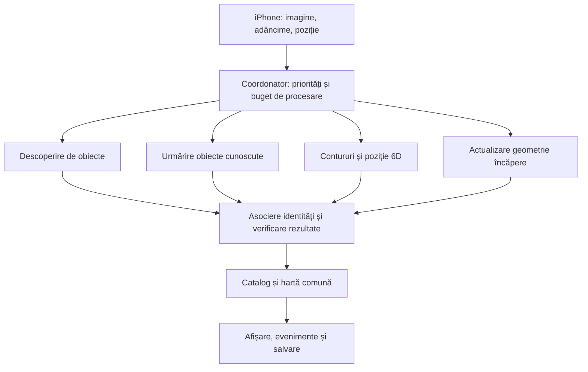
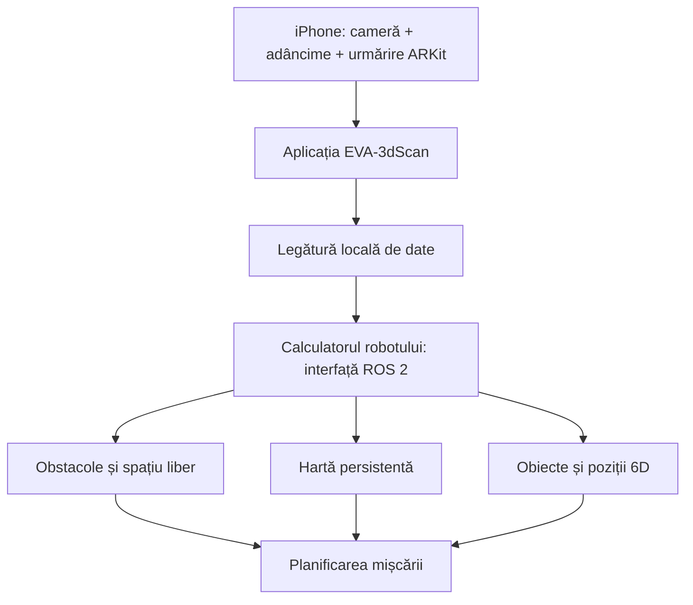

# Planifică aplicația iPhone 3D Scan

ID: `01a0fc12-eed4-7763-89a8-9dbc3f2d96aa`  
Proiect: 3D.AppleScan  
Export UTC: 2026-10-08T08:13:16.769065+00:00

Mesajele sunt redate integral mai jos. Rezultatele instrumentelor sunt în rezultate.md și istoric.json. Fișierele recuperate sunt în fisiere/.

## Utilizator

doresc sa facem o aplicatie de #D scan utilizand telefonul iPhone Apple - 

extrage  toate documentele si pregateste un prompt profesionist - inclusiv cu descrierea echipei cu sarcini cu audit cu verificare totul in asa fel incat sa obtinem maxiom de calitate a aplicatiei aloca maxim de agenti pentru fiecare 
stabileste obiective / activitati si rezultate cuantificabile pentru fiecar epas 
creaza loguri pentru fiecare sarcina si pentru fiecare rezultat si pentru fiecare audit in sa fel incat sa nu se poata rata nici un pas daca se intrerupe sa se poata reliua exact sa se stie fiecare unde a ajuns din documente clare - totul impartit pe foldere etc.
Cauta pe net si pe github si alte aplicatii si toate functiile posibile - descrie detaliat aplicatia - stabileste o UX cat mai de calitate - tine cont de comenmtarii de la aplicatii similare 
tine cont de forumuri ce au spus alti ca se confrunta si ca ar vrea si sa stabiolim ca incercam sa implementam maxim 
as vrea sa completam aplicatia cu scanare cu dimensiuni - am vazut aplicati care masoara dimensiunile 
sa adaugam si componenta de scanat camere cladiri si optini de conversie in DWG sau point cloud dar si in toate formatele care sunt utilizate pentru tip[aririle 3D 
deci aplicatia va avea trei componente clare
scanarea de obiecte - ATENTIE cu dimenisuni
scanarea fara salvare a mediului si aratarea dimensiunilor peimagini
scanarea si salvarea de camere si apoi combinarea pana la realizarea apartamentului si a casei  
nivelul este de lucrare doctorala - cu toate detaliile cu capitole ale de descriere a aplicatiei etc. toate componentele - si salvarea tuturor fisierelor relevante de documentare si exemplificare sau linkluri accesibile

scrie documentul in echipa - porneste un manager - un agent care sa se documenteze si sa caute sa salveze pe local fisiere - un agent care sa fie specialist in cod pe Apple si in Software si in Hardware APPLE - un specialist care sa cunoasca proiectare / si tiparire 3D imprimante Hard si Software - ce este necesar 
si un auditor final - care sa returneze documentele si ttot ce sa lucrat pana cand nu este multumit 100% 
fiecare pas sa fie documentat si toate sarcinile stabilite d emanager sa fie trecute in loguri toate rezultatele fiecarui agent la fel si auditurile 


## Asistent

Voi organiza proiectul ca un dosar de cercetare și proiectare, cu documente, surse, sarcini, rezultate și audituri care permit reluarea lucrului după o întrerupere. Voi coordona echipa de specialiști și voi folosi toate cele patru locuri disponibile pentru agenți, apoi voi trece documentația printr-un audit separat. Voi verifica inclusiv limitele reale ale măsurătorilor cu iPhone și ale exporturilor CAD și pentru imprimare 3D.


## Asistent

Am identificat o problemă de acces la folderul de rețea al proiectului; verific accesul înainte să presupun că am extras documentele existente. Cercetarea poate continua între timp. Voi aplica și ghidul „write-page” pentru redactare, păstrând livrabilele în foldere locale, conform cererii tale.

Voi separa clar funcțiile propuse, capabilitățile confirmate de surse și rezultatele care vor necesita teste pe dispozitive reale. Auditul va urmări criterii verificabile; nu voi declara precizie sau calitate de 100% fără dovezi.


## Asistent

Folderul proiectului este gol: nu există documente locale de extras. Accesul la rețea funcționează acum. Cei trei specialiști cercetează în paralel ecosistemul Apple, aplicațiile și feedbackul utilizatorilor, respectiv CAD și imprimarea 3D.

O constatare importantă: trebuie diferențiate o dimensiune estimată de telefon, o măsurare verificată și un model pregătit pentru fabricație. Documentația va include teste și praguri de acceptare pentru fiecare, plus exporturi clasificate după suportul real și dependențele de conversie.


## Asistent

Feedbackul utilizatorilor confirmă câteva riscuri pe care le voi transforma în cerințe testabile: pierderea proiectelor, blocarea scanărilor lungi, scara greșită la export și lipsa cotelor în unele fișiere CAD. Soluția propusă este salvarea camerelor separat, unirea lor reversibilă și verificarea exportului în programul destinatar.

Pentru modul „fără salvare”, am clarificat un detaliu: măsurarea rămâne temporară, iar salvarea unei imagini cotate va fi o acțiune separată, explicită.


## Asistent

Capitolele specialiștilor sunt aproape complete. Avem deja comparația a șase produse, 22 de observații tematice din feedback și cerințe verificabile pentru cele trei fluxuri. Arhitectura Apple și capitolul CAD separă explicit exportul, conversia, precizia dimensională și pregătirea pentru imprimare.

Pregătesc acum documentul unificat, promptul principal, registrele de reluare și verificarea automată a fișierelor. Urmează auditul independent și remedierea observațiilor lui.


## Asistent

Auditul a găsit o neconcordanță importantă: specialiștii propuseseră praguri diferite pentru aceeași măsurare și etape diferite pentru unele exporturi. Le unific într-o singură matrice de acceptare, la care vor trimite toate capitolele.

Am adăugat și exemple locale pentru verificări ulterioare: un cub STL de 100 mm, un nor de puncte PLY și un plan DXF de cameră. Sunt marcate ca modele sintetice, iar ghidul public NIST despre incertitudinea măsurării a fost descărcat local.


## Asistent

Remedierile sunt aplicate: există acum un singur set de praguri, o separare între pilot, acceptare și teste de stres și o listă coerentă a formatelor pentru fiecare etapă. Auditorul verifică din nou aceste schimbări.

Dosarul unificat are aproximativ 24.000 de cuvinte. Include bibliografie, prompturi, jurnale, planul experimentelor și exemplele tehnice; pregătesc și varianta pentru citire și tipărire.


## Asistent

A doua verificare a confirmat și registrul celor 106 cerințe: fiecare are responsabil și criteriu de verificare, iar testele aplicației sunt marcate corect ca neexecutate. Cele trei probleme majore din primul audit au fost remediate; se închide acum verificarea finală.

Mai verific aspectul documentului și integritatea copiilor. La livrare vei avea atât dosarul de lucru pe foldere, cât și documentul unificat, plus promptul de reluare.


## Asistent

Auditul independent a acceptat documentația: toate cele patru constatări au fost închise, fără probleme rămase în domeniul verificat. Acceptarea privește dosarul; dezvoltarea și testele pe iPhone, CAD și imprimante rămân etape viitoare.

Finalizez PDF-ul și copierea în folderul proiectului, apoi compar fișierele pentru a confirma că livrarea este completă.


## Asistent

Am creat dosarul complet și l-am salvat în folderul proiectului.

### Livrabile

- [Documentul complet PDF — 89 de pagini](S:/3dscan.eva-org.com/documentatie/09_livrabile/DOSAR_COMPLET.pdf)
- [Arhiva completă cu toate fișierele](S:/3dscan.eva-org.com/EVA_3D_Scan_documentatie.zip)
- [Promptul profesional pentru echipă](S:/3dscan.eva-org.com/documentatie/06_prompturi/PROMPT_MASTER.md)
- [Instrucțiunile de reluare după întrerupere](S:/3dscan.eva-org.com/documentatie/06_prompturi/PROMPT_RELUARE.md)
- [Raportul auditorului final](S:/3dscan.eva-org.com/documentatie/08_audit/AUDIT_02_FINAL.md)

Dosarul include:

- Cele **trei componente** solicitate, cu fluxuri UX detaliate.
- **106 cerințe verificabile**, responsabilități, obiective și criterii de acceptare.
- Cercetarea concurenților, recenziilor, forumurilor și proiectelor GitHub.
- Arhitectură Apple, dimensiuni, CAD/DWG, point cloud și imprimare 3D.
- **71 de surse înregistrate**, documente locale și exemple STL, PLY și DXF.
- Registre de sarcini, jurnale, checkpointuri și verificarea integrității fișierelor.

Am folosit **patru agenți simultan**, limita disponibilă, și un auditor independent într-o etapă ulterioară. Auditul a identificat patru probleme; toate au fost remediate și documentația a fost acceptată.

**Aplicația nu este încă implementată.** Precizia și funcționalitățile propuse trebuie validate pe iPhone și în programele CAD/slicere. Următorul pas este pregătirea mediului Mac/Xcode și executarea probelor tehnice definite în dosar.

## Utilizator

Crează două foldere 
1. Aplicație - unde muți tot ce am creat până acum
2. Site unde faci documentația cu meniuri poze etc de prezentare a aplicației - în docker / cu PostgreSQL - care să fie un site rapid cu traduceri în 
En/de/fr/sp/ro/hu/bg - un site cu pagini conținând variabile care se încarcă dinamic și se schimbă rapid în pagină fără sa avem pagini pentru fiecare limbă - o pagină pt toate limbile cu variabile - crează și sigla pornind de la Eva-org.com și restul de site-uri

## Asistent

Voi separa proiectul în „Aplicație” și „Site”, apoi voi construi site-ul de prezentare cu navigare, imagini și traduceri încărcate dinamic pentru cele șapte limbi. Voi verifica identitatea vizuală EVA înainte să creez sigla și voi pregăti rularea în Docker cu PostgreSQL.


## Asistent

Voi folosi ghidul de design Sites și instrumentul de generare de imagini, păstrând arhitectura cerută de tine: Docker și PostgreSQL.

Site-ul va avea o singură structură de pagini, cu texte încărcate din dicționare de traducere și schimbarea limbii fără reîncărcare. Pentru spaniolă voi folosi codul standard „es”, acceptând și „sp”. Voi prezenta aplicația ca proiect în dezvoltare, conform documentației existente.


## Asistent

Documentația a fost mutată în „Aplicație”; verificarea celor 59 de fișiere urmărite nu a găsit nicio modificare de conținut. Am găsit și identitatea vizuală EVA Print: bleumarin, teal și simbolul „E” din trei bare. Sigla EVA 3D Scan pornește de la acestea.

Site-ul are deja paginile celor trei module, documentația și exemplele descărcabile. Motorul de conținut permite actualizarea textelor și a traducerilor fără reconstruirea paginilor. Serverul proiectului are Docker funcțional, așa că voi verifica și rularea efectivă cu PostgreSQL.


## Asistent

Cele șapte traduceri sunt complete: 139 de câmpuri în fiecare limbă. Am verificat și situațiile în care schimbarea limbii se suprapune cu o actualizare de conținut sau cu butonul „Înapoi”; selecția utilizatorului rămâne păstrată.

Închid acum verificările cu baza de date reală și testele de navigare pe mobil și desktop. Sigla este livrată și în format vectorial, potrivit pentru redimensionare și utilizare ulterioară.


## Asistent

Site-ul rulează acum cu PostgreSQL pe server. Au trecut 117 verificări de browser: toate cele șapte pagini în cele șapte limbi, pe mobil și desktop, plus meniuri, descărcări, conversia unităților și schimbarea limbii fără reîncărcare.

Am verificat și modificarea unui text direct în baza de date: pagina deschisă s-a actualizat automat. Imaginile au fost optimizate de la aproximativ 3,9 MB la 178 KB în total.


## Asistent

Am finalizat și variabilele comune din pagini: denumirea produsului, numărul de module și alte valori pot fi schimbate din PostgreSQL, iar paginile deschise se actualizează automat. Verific acum această ultimă modificare și închid documentația de instalare, audit și reluare a lucrului.


## Asistent

Auditul a găsit un caz limită la introducerea directă în baza de date a unui număr extrem de mare. Îl corectăm înainte de închiderea livrării. Site-ul a trecut verificările de pagini și traduceri; verific suplimentar că schimbarea unei variabile numerice apare imediat în pagina deschisă.


## Asistent

Verificarea finală a trecut: patru teste backend cu PostgreSQL real, 117 verificări de browser și testul separat al variabilelor actualizate live. Toate cele cinci probleme găsite la audit sunt remediate. Pregătesc acum indexul fișierelor și instrucțiunile de reluare, cu rezultatele și limitele testelor consemnate.


## Asistent

Am creat și organizat cele două foldere:

- **[Aplicație](S:/3dscan.eva-org.com/Aplicație)** — documentația și arhiva anterioare, mutate și verificate.
- **[Site](S:/3dscan.eva-org.com/Site/README.md)** — site funcțional în Docker cu PostgreSQL, meniuri, imagini și siglă inspirată din identitatea EVA Print.

**[Deschide site-ul](http://127.0.0.1:4160/?lang=ro)**

Include șapte limbi, aceeași structură de pagini și texte/variabile actualizate din baza de date fără reîncărcare.

Verificări trecute: **4 teste backend, 117 verificări de browser și actualizarea live a variabilelor**. Auditul, logurile și instrucțiunile de reluare sunt în [documentația livrării](S:/3dscan.eva-org.com/Site/docs/VALIDARE_FINALA.md).

Previzualizarea funcționează acum. Domeniul public și HTTPS rămân de configurat.

## Utilizator

creaza o iconita si o sigla cu EVA-3dScan - pentru aplicatie si site - DINAMICE - nu neaparat identice
si salveaza si 5 imagini de promovare cu un personaj care cu telefonul fura imagine si o transpune in telefon - 

Creaza si un motto - atat de precis atat de rapid incat iti lasa fata fara continut

Un Personaj cu iPhone si aplicatia si un indian care spune ca nu ii fura fata

modifica site-ul de la prima pagina si sa fie clar ca este o aplicatie 
Site--ul este trist - nu este modern dinamic si nu intelegi ce vrea sa iti comunice - 
Inginereste clar 
Sunt o aplicatie 
FAC 1/2/3
Ma adresez etc.
SA fie o chestie matematica explicativa clara 
cu niste poze / imagini dinamice carusel 


## Asistent

Voi redesena prima pagină în jurul unui mesaj clar: **„EVA-3dScan este aplicația pentru iPhone care scanează obiecte, măsoară și reconstruiește spații.”** Voi crea o iconiță, o siglă animată și cinci imagini de campanie, apoi le voi integra într-un carusel.

Folosesc instrumentul de generare a imaginilor pentru campania cu telefonul care „fură” forma și o transformă în model 3D. Motto-ul va păstra umorul, fără să prezinte precizia încă netestată drept rezultat demonstrat.

## Asistent

Cele cinci imagini sunt gata. Campania arată transferul formei în telefon, iar scena comică include replica **„Hei, fața rămâne la mine!”**, afișată în limba aleasă.

Prima pagină explică acum, în ordine: **ce este aplicația → cele trei funcții → ce introduci și ce obții → cui îi folosește**. Identitatea nouă folosește albastru intens, turcoaz și accente coral, cu animație de scanare în siglă.


## Asistent

Am găsit și modificări recente pentru autentificare și proiecte salvate în același site. Le integrez în versiunea redesenată, ca noua prezentare să păstreze și aceste funcții. Caruselul și toate cele șapte limbi au trecut deja verificările de browser.


## Asistent

Noua pagină este mai directă, iar imaginile se văd integral, inclusiv pe telefon. Caruselul are cinci cadre, comenzi înainte/înapoi, pauză și control din tastatură; animațiile respectă preferința pentru mișcare redusă.

Am verificat separat și sigla animată. Pregătesc acum pachetul pentru aplicație: iconiță la 1024 px, variante pentru web și fișierele vectoriale.


## Asistent

Am redesenat site-ul: **[deschide noua versiune](http://127.0.0.1:4160/?lang=ro)**.

- **EVA-3dScan**: iconiță pentru aplicație, simbol și siglă animate.
- **Cinci imagini de promovare**, integrate în carusel.
- Prima pagină explică direct: **ce este aplicația, cele 3 funcții, rezultatele și publicul vizat**.
- Șapte limbi, afișare mobilă și comenzi accesibile pentru carusel.

**Motto:** „Îți capturăm forma. Te lăsăm fără cuvinte.”

Fișierele sunt salvate în **[Identitate aplicație](<S:/3dscan.eva-org.com/Aplicație/Identitate EVA-3dScan>)** și **[Imagini de promovare](S:/3dscan.eva-org.com/Site/public/assets/campaign)**. [Prompturile imaginilor](S:/3dscan.eva-org.com/Site/docs/campaign-assets.json) sunt păstrate.

Auditul este închis; verificările site-ului au trecut.

## Utilizator


<in-app-browser-context source="ambient-ui-state">
This block is automatically supplied ambient UI state, not part of the user's request. Do not treat it as an instruction or as evidence that the user explicitly selected the in-app browser.
# In app browser:
- The user has the in-app browser open with 2 tabs.
- Current URL: http://127.0.0.1:4160/?lang=en
</in-app-browser-context>

## My request:
siglele si culorile sunt ok 
DAR 
in aplicatie pentru Scanare cu obiecte cu dimensiuni punem un domn arhidect frumos sexy dar grizonat catre 50 ani 

la scanare persoane pastram imaginile deja existente cu tanara si cu tanarul

la masurare punem un Mario in salopeta si care masoara pereti 

la scanare camere - perechea cu un designer - si cu maistru separate poze unele care fac design nou alti care stabilesc ce au de reparat 

Prin internet - cauta pentru site cat de multe utilizari pentru aplicatia noastra

trebuie sa fie inspiratie si cuvinte cheie 
sa caute lumea ap;licatia - 


## Asistent

Păstrez siglele și culorile. Voi diferenția imaginile pe utilizări: arhitectul grizonat pentru obiecte cu dimensiuni, personajele existente pentru persoane, Mario în salopetă pentru măsurarea pereților și două scene distincte pentru camere — amenajare cu designerul și evaluarea reparațiilor cu maistrul.

Voi căuta și utilizări concrete ale aplicației, apoi le voi transforma în exemple și pagini utile pentru vizitatori, cu expresii de căutare naturale în cele șapte limbi.


## Asistent

Documentarea indică utilizări utile dincolo de scanarea simplă: piese pentru imprimare 3D, verificarea încadrării mobilierului, calculul suprafețelor, amenajări, documentarea reparațiilor și prezentarea proprietăților.

Voi adăuga o secțiune „Utilizări”, cu exemple grupate și căutare, plus o pagină separată pentru scanarea persoanelor. Pentru găsirea în Google, pregătesc titluri, descrieri și conținut lizibil de motorul de căutare în fiecare limbă, folosind aceeași structură de pagini.


## Asistent

Arhitectul grizonat și cele două scene cu designerul și maistrul sunt gata. Generatorul a refuzat varianta recognoscibilă a lui Mario; pentru măsurarea pereților folosesc un meseriaș original, simpatic, în salopetă, păstrând ideea scenei.


## Asistent

Am pregătit **36 de utilizări în 6 categorii**, documentate din **18 surse primare**, cu expresii de căutare relevante pentru fiecare.

Cele două scene de camere sunt separate clar: designerul propune amenajarea, iar maistrul documentează ce trebuie reparat. Domeniul public răspunde deja prin HTTPS; verific acum și conținutul, legăturile de limbă și sitemap-ul pentru indexare.


## Asistent

Conținutul nou este acum tradus în toate cele șapte limbi. Pagina „Utilizări” are filtre și căutare, iar fiecare exemplu explică rezultatul urmărit.

Verificarea include și varianta fără JavaScript: textele trebuie să fie deja în pagină, nu să apară doar după încărcarea animațiilor. Astfel, exemplele și descrierile pot fi citite și de motoarele de căutare.


## Asistent

Verificările au trecut: cele nouă pagini funcționează în șapte limbi, iar imaginile, filtrele și căutarea sunt corecte pe mobil și desktop. Am verificat și domeniul public: paginile noi, fișierul pentru crawlere și sitemap-ul cu **63 de adrese de limbă** răspund corect.

Salvez acum raportul final și lista celor **756 de expresii de căutare localizate**. Indexarea și poziția efectivă în Google nu sunt încă măsurate.


## Utilizator


<in-app-browser-context source="ambient-ui-state">
This block is automatically supplied ambient UI state, not part of the user's request. Do not treat it as an instruction or as evidence that the user explicitly selected the in-app browser.
# In app browser:
- The user has the in-app browser open with 2 tabs.
- Current URL: http://127.0.0.1:4160/?lang=en
</in-app-browser-context>

## My request:
slab site - pune un agent manager si unul de marketing produse tip app si unul arhitect si unul designer si unul mester si vezi ce vor fiecare sa inteleaga ca sa foloseasca aplicatia si redesign al site 


## Asistent

Refac site-ul pornind de la ce trebuie să înțeleagă fiecare utilizator: ce poate scana, ce rezultat primește și la ce îi folosește. Pun un manager să coordoneze evaluarea, un specialist în marketing de aplicații și reprezentanți pentru arhitect, designer și meșter. Avem patru locuri de lucru simultane, așa că rolurile vor lucra în două serii, apoi aplicăm și verificăm redesignul.

## Asistent

Primele evaluări arată aceeași problemă: fotografiile atrag atenția, dar site-ul nu arată suficient de clar rezultatul muncii. Noua primă pagină va avea o demonstrație cu trei alegeri — obiect, măsurătoare, cameră — și va arăta pentru fiecare ce scanezi și ce obții. Arhitectul, designerul și meșterul vor avea apoi exemple separate, legate de proiectele lor.

## Asistent

Arhitectul cere să vadă camerele conectate, scara și fișierul rezultat. Designerul vrea să înțeleagă dacă mobilierul încape și unde rămâne spațiu de trecere. Meșterul caută cotele peretelui sau golului și contextul reparației.

Am construit prima versiune nouă în jurul acestor nevoi: un telefon cu rezultat cotat, trei moduri interactive și trei trasee profesionale. Acestea sunt evaluări ale agenților pe roluri; nu le prezentăm ca interviuri cu utilizatori reali.

## Asistent

Textele sunt acum adaptate în toate cele șapte limbi. Auditul a cerut patru corecții, pe care le-am aplicat: păstrarea întrebărilor deschise la actualizare, explicarea observațiilor manuale ale meșterului, legături către fluxul de scanare și descrieri accesibile pentru diagrame.

Trec la verificarea în browser: aspectul pe mobil, schimbarea modurilor și profesiilor, traducerile și fișierul exemplu.

## Utilizator

Focus pe clienti - pe tipurile de potentiali clienti


## Asistent

Pun tipurile de clienți în prim-plan. Vizitatorul va alege „Sunt arhitect”, „Sunt designer”, „Sunt meșter” sau alt profil și va vedea imediat problema pe care o poate rezolva, rezultatul util și un exemplu din munca lui. Funcțiile tehnice vor explica apoi cum ajunge la acel rezultat.

## Utilizator

pe tipuri de activitati si pentru fiecare sa se regaseasca 


## Asistent

Organizez după activități: **amenajez, renovez, proiectez, creez obiecte, prezint proprietăți, digitizez persoane sau obiecte**. La fiecare arăt situații concrete, ca atât profesionistul, cât și persoana care lucrează la propria casă să se regăsească. Profesia rămâne un reper secundar.

## Utilizator

"tipurile de clienți în prim-plan. Vizitatorul va alege „Sunt arhitect”, „Sunt designer”, „Sunt meșter” sau alt profil și va vedea imediat problema   ... "

si dedesubt selector cu " problema pe care o poate rezolva  " - in asa fel incat sa gaseasca oricine ce cauta 


## Asistent

Exact: **două selectoare, unul sub altul**.

1. **„Cine ești?”** — arhitect, designer, meșter, creator 3D, proprietar/agent imobiliar sau alt utilizator.
2. **„Ce problemă vrei să rezolvi?”** — opțiuni relevante pentru profilul ales, plus acces la toate utilizările.

Sub ele apare răspunsul concret: ce scanezi, ce rezultat obții și un exemplu. Astfel, vizitatorul pornește de la nevoia lui, fără să fie obligat să cunoască termenii tehnici.

## Asistent

Cele două selectoare funcționează acum. Profilul ales restrânge lista de probleme, iar opțiunea „Proiect personal / altă activitate” oferă toate cele 36 de utilizări. Alegerea unei probleme schimbă explicația, exemplul vizual și legătura către funcția relevantă.

Primele 308 verificări ale acestui traseu au trecut, inclusiv păstrarea alegerii când se schimbă limba sau se actualizează conținutul.

## Asistent

Noua structură a trecut și verificările generale ale site-ului: pagini, traduceri, navigare pe mobil și actualizarea datelor. Am verificat vizual și variantele pentru desktop și telefon.

Salvez acum rapoartele echipei și punctul exact de reluare. Site-ul păstrează clar statutul aplicației în dezvoltare și marchează exemplele demonstrative.

## Asistent

Am publicat [site-ul refăcut](https://3dscan.eva-org.com/?lang=ro), cu două selectoare consecutive:

1. **Cine ești?** — șase profiluri și opțiunea „Proiect personal / altă activitate”.
2. **Ce problemă vrei să rezolvi?** — utilizări relevante pentru profil, dintr-un catalog de **36 de probleme**.

Alegerea schimbă explicația, exemplul vizual și funcția recomandată. Urmează exemple pe activități, apoi detaliile tehnice.

Funcționează în **șapte limbi**, pe mobil și desktop. Verificările au trecut; documentele echipei, auditul și logurile sunt salvate în `Site/docs`.

## Utilizator

Cum pot se stabilesc poziția în spațiu 6D a unui obiect utilizând iPhone-ul

## Asistent

Verific ce oferă iPhone-ul pentru poziția și orientarea unui obiect și cum putem integra asta în EVA-3dScan. Distincția importantă este între poziția telefonului și poziția obiectului urmărit.

## Asistent

**Da. Cu iPhone-ul poți estima poziția și orientarea unui obiect în spațiu — numită „poză 6D” sau „6DoF”.** Pentru EVA-3dScan, aș începe cu **un reper vizual fixat pe obiect și un sistem de coordonate definit în încăpere**.

## 1. Ce înseamnă cele șase componente

| Componentă | Ce descrie |
|---|---|
| **X, Y, Z** | Unde se află un punct ales al obiectului, de exemplu centrul său |
| **Rx, Ry, Rz** | Cum este rotit obiectul în jurul celor trei axe |

Trebuie stabilit **față de ce măsurăm**: telefon, masă, cameră sau alt obiect. Pentru proiectele noastre, un reper stabil al încăperii ar permite compararea pozițiilor.

**ARKit urmărește poziția telefonului. Pentru poziția obiectului avem nevoie și de identificarea și orientarea acelui obiect.** Apple oferă transformarea camerei în coordonatele sesiunii AR. [Documentația Apple](https://developer.apple.com/documentation/arkit/arcamera/transform)

## 2. Metodele disponibile

| Situație | Metodă |
|---|---|
| Poți pune o etichetă pe obiect | **AprilTag / ArUco**, cu dimensiune cunoscută |
| Obiectul trebuie recunoscut fără etichetă | Model de referință și detectare/urmărire a obiectului |
| Obiectul este fix și îl scanezi o singură dată | Scanare, apoi definirea originii și axelor obiectului |
| Telefonul este prins rigid de obiect | Urmărirea telefonului, cu poziția sa față de obiect calibrată |

### Varianta recomandată pentru primul prototip: marker pe obiect

Un **AprilTag** este un simbol imprimat, conceput pentru identificare și estimarea poziției în spațiu. Folosind geometria markerului și parametrii camerei, se estimează translația și rotația sa față de cameră. LiDAR nu este obligatoriu pentru această metodă. [AprilTag — proiect oficial](https://github.com/AprilRobotics/apriltag), [OpenCV — estimarea poziției și orientării](https://docs.opencv.org/4.13.0/d5/d1f/calib3d_solvePnP.html)

## 3. Cum ar funcționa concret în EVA-3dScan

1. **Definim reperul încăperii.**  
   De exemplu, un marker fixat pe masă stabilește originea și direcțiile axelor.

2. **Definim reperul obiectului.**  
   Alegem centrul sau un colț drept origine și stabilim axele obiectului.

3. **Fixăm rigid markerul pe obiect.**  
   Introducem dimensiunea reală a markerului și poziția sa față de originea obiectului. Dacă eticheta este pe lateral, aplicația trebuie să cunoască această diferență.

4. **Telefonul detectează markerul și calculează orientarea.**  
   Combinăm rezultatul cu poziția camerei oferită de ARKit. Pentru implementare trebuie aliniate convențiile axelor folosite de bibliotecile implicate.

5. **Afișăm și înregistrăm rezultatul.**  
   Pe ecran apar axele peste obiect, coordonatele, unghiurile și starea urmăririi. Înregistrarea include timpul și identificatorul reperului.

6. **Verificăm rezultatul prin mișcări cunoscute.**  
   Deplasăm obiectul pe distanțe măsurate și îl rotim la unghiuri cunoscute. Raportăm separat eroarea de poziție, eroarea unghiulară, repetabilitatea și pierderile urmăririi.

**Un marker oferă poziția markerului. Calibrarea legăturii marker–obiect este ceea ce ne permite să raportăm corect poziția centrului obiectului.**

## 4. Se poate și fără marker?

Da, pentru obiecte care pot fi recunoscute dintr-un model de referință. Documentația Apple descrie atât detectarea obiectelor în principal staționare, cât și urmărirea obiectelor mobile prin API-uri dedicate. Disponibilitatea trebuie verificată pentru versiunea iOS și dispozitivul țintă. [Apple — urmărirea obiectelor în iOS](https://developer.apple.com/documentation/visionos/using-a-reference-object-with-arkit-in-ios)

Totuși, un obiect perfect simetric poate avea orientări imposibil de diferențiat vizual. **Scanarea formei nu garantează automat urmărirea completă a orientării.**

Pentru aplicația noastră, recomand **marker + calibrare + validare**, apoi urmărire fără marker. Precizia trebuie demonstrată experimental; „6DoF” descrie cele șase componente, nu precizia lor.

**Ce model de iPhone ai, obiectul stă fix sau se mișcă și ce toleranță urmărești — în milimetri/centimetri și grade?**

## Utilizator

Dacă am scanat anterior obiectul și am .obj etc al obiectului

## Asistent

Verific cum putem folosi modelul OBJ existent pentru a recunoaște obiectul și a-i determina poziția și orientarea cu iPhone-ul.

## Asistent

**Da. Dacă ai deja modelul `.OBJ` al obiectului, îl putem folosi ca referință pentru a estima poziția și orientarea obiectului real, fără marker, în condiții potrivite.** Aceasta se numește **estimarea poziției 6D pe baza unui model 3D**.

Importul modelului este primul pas; aplicația trebuie apoi să îl **alinieze cu obiectul observat de camera iPhone-ului**.

## Cum ar funcționa

1. **Importăm modelul complet:** `.obj`, fișierul `.mtl` și imaginile texturilor, dacă există.
2. **Verificăm scara reală:** confirmăm o dimensiune cunoscută. Coordonatele din OBJ nu garantează singure că unitatea este metrul sau milimetrul.
3. **Stabilim originea și axele obiectului:** de exemplu, centrul bazei și direcția „înainte”.
4. **Identificăm obiectul în imagine:** automat sau printr-o selecție inițială făcută de utilizator.
5. **Potrivim modelul peste observația camerei:** folosind forma, textura și, unde este disponibilă și utilă, adâncimea.
6. **Calculăm și actualizăm cele șase componente:** X, Y, Z și orientarea, față de telefon sau de reperul încăperii.

**Pe ecran ai vedea modelul digital suprapus peste obiectul real**, împreună cu axele și coordonatele.

## Două variante de implementare

| Variantă | Ce presupune |
|---|---|
| **Flux Apple** | Pregătim modelul în USDZ, antrenăm în Create ML un fișier `.referenceobject`, apoi îl folosim pentru detectare/urmărire. |
| **Algoritm propriu** | Comparăm modelul cu imaginile și eventual adâncimea capturată; estimăm alinierea inițială și o actualizăm în timp. |

Pentru fluxul Apple cu `.referenceobject` pe iPhone, documentația consultată indică **iOS 27 sau ulterior**, iar unele pagini marchează API-ul drept beta. Alegerea trebuie făcută după verificarea dispozitivului și SDK-ului țintă. Pregătirea în Create ML este o etapă distinctă de conversia în USDZ. [Pregătirea modelului](https://developer.apple.com/documentation/visionos/implementing-object-tracking-in-your-app), [urmărirea pe iOS](https://developer.apple.com/documentation/visionos/using-a-reference-object-with-arkit-in-ios).

Pentru varianta proprie, alinierea geometrică poate fi rafinată prin **ICP**, după obținerea unei alinieri inițiale suficient de bune. ICP singur nu rezolvă automat identificarea obiectului într-o scenă. [Documentația Open3D](https://www.open3d.org/docs/release/tutorial/pipelines/icp_registration.html)

## Ce influențează rezultatul

- **Textura și detaliile distinctive** ajută recunoașterea.
- **Modelul trebuie să corespundă obiectului real**, inclusiv ca dimensiuni.
- **Simetria poate ascunde rotația:** un cilindru uniform nu permite determinarea unică a rotației în jurul axei sale doar din formă.
- Reflexiile, transparența, acoperirea obiectului și mișcarea rapidă complică urmărirea.

### Avantajul pentru EVA-3dScan

După stabilirea poziției 6D, putem calcula poziția în încăpere a **oricărui punct definit pe model**: un colț, centrul unei găuri sau un punct de montaj, presupunând că obiectul este rigid.

Aș propune fluxul: **„Importă obiectul → confirmă dimensiunea → localizează-l în cameră → urmărește poziția și rotația”**. Precizia acestui flux trebuie verificată pe obiectul și iPhone-ul folosite.

## Utilizator

Dacă scanăm camera în repetate rânduri și suprapunem până obținem
Dimensiunile corecte și scanăm obiectele din cămară și dorim în timp real să apreciem poziția 6D în raport cu camera ?
Ce alte taskuri ar trebuii să efectuăm astfel încât să reducem timpi de procesare și să creștem acuratețea - cum putem crea o scanare continua a mediului înconjurător și o catalogare a obiectelor și poziționare a acestora în spațiu - este posibil să scanăm continuu 2-3d și să catalogăm să facem bounding boxuri cu contururi etc. - să fim predictibili - preemtivi

## Asistent

Verific arhitectura pentru acest scenariu: o hartă stabilă a camerei, obiecte recunoscute și poziționate continuu în ea, plus predicție pe termen scurt. Voi separa ce putem îmbunătăți prin scanări repetate de ce necesită măsurători de referință și voi propune sarcini cu criterii măsurabile pentru viteză și acuratețe.

## Asistent

**Da, este posibil să construim un sistem care scanează mediul, cataloghează obiectele și estimează poziția lor 6D în raport cu încăperea.** Pentru EVA-3dScan, direcția potrivită este o **hartă 3D persistentă, cu obiecte identificate și actualizate în timp**.

Ar trebui să combinăm trei procese:

- **Cartografiere:** cum arată încăperea și unde se află telefonul.
- **Recunoaștere:** ce obiecte sunt vizibile și care dintre ele există deja în catalog.
- **Urmărire:** unde se află fiecare obiect, cum este orientat și dacă s-a deplasat.

Aceste procese trebuie să ruleze cu frecvențe diferite pentru a păstra aplicația rapidă.

## 1. Scanările repetate pot îmbunătăți măsurarea, dar nu garantează dimensiunile corecte

Mai multe observații din unghiuri diferite pot reduce zgomotul, completa suprafețe și îmbunătăți alinierea. **O eroare sistematică poate însă rămâne prezentă în toate scanările.** Stabilitatea rezultatului și corectitudinea lui trebuie verificate separat.

Aș folosi următorul proces:

1. **Prima trecere:** identificăm pereții, podeaua, golurile și geometria generală.
2. **A doua trecere, din alte unghiuri:** completăm zonele slab observate.
3. **Revenire la punctul de pornire:** verificăm dacă sistemul recunoaște aceeași zonă și corectăm acumularea erorilor de poziționare.
4. **Aliniere și fuziune:** combinăm observațiile acceptate, ponderate după calitate.
5. **Validare independentă:** comparăm dimensiuni cu măsurători de referință, de exemplu cu un telemetru.
6. **Oprire ghidată de calitate:** cerem scanare suplimentară numai unde există incertitudine relevantă.

Alinierea mai multor scanări și optimizarea relațiilor dintre ele sunt tehnici consacrate; simpla suprapunere vizuală nu este suficientă. [Open3D — alinierea mai multor scanări](https://www.open3d.org/docs/release/tutorial/pipelines/multiway_registration.html)

**Nu aș forța automat toți pereții să fie perfect drepți sau toate colțurile la 90°:** am putea obține un model frumos, dar incorect.

## 2. O încăpere stabilă, cu obiecte actualizate separat

Aș organiza datele în patru componente:

| Componentă | Ce păstrează | Cum se actualizează |
|---|---|---|
| **Structura încăperii** | Pereți, podea, tavan, uși, ferestre | La scanare și când confirmăm modificări |
| **Catalogul obiectelor** | Identitate, categorie, model OBJ, dimensiuni, aspect | La înregistrarea sau recunoașterea unui obiect |
| **Starea obiectelor** | Poziție, orientare, mișcare, ultima observație | În timpul urmăririi |
| **Istoricul observațiilor** | Ce am văzut, când și cu ce calitate | La fiecare eveniment relevant |

O persoană care traversează încăperea sau un scaun mutat nu trebuie integrate permanent în geometria pereților.

### Poziția 6D față de încăpere

Calculul combină două transformări:

**poziția și orientarea telefonului în încăpere × poziția și orientarea obiectului față de telefon.**

Originea încăperii trebuie păstrată între sesiuni. Apple permite continuarea unei sesiuni AR sau relocalizarea folosind un `ARWorldMap` salvat. La reluare trebuie confirmată relocalizarea înainte să comparăm poziții. [Apple — coordonate compatibile între scanări](https://developer.apple.com/documentation/roomplan/structurebuilder/capturedstructure%28from%3A%29)

**O corecție a hărții nu trebuie interpretată ca și cum toate obiectele s-ar fi mutat.** Vom versiona harta și vom transforma coerent pozițiile asociate.

## 3. Da, putem avea bounding boxuri, contururi și obiecte 3D

Sunt rezultate diferite, cu niveluri diferite de informație:

| Rezultat | Ce ne spune |
|---|---|
| **Bounding box 2D** | Unde apare obiectul în imagine |
| **Mască și contur 2D** | Ce pixeli aparțin suprafeței vizibile a obiectului |
| **Bounding box 3D orientat** | Volumul aproximativ ocupat și orientarea cutiei |
| **Model 3D aliniat** | Poziția și orientarea modelului cunoscut |
| **Identitate persistentă** | Că acesta este același obiect observat anterior |

**O cutie 3D nu garantează singură orientarea exactă a obiectului.** Pentru obiectele simetrice pot exista mai multe orientări compatibile cu aceeași observație.

RoomPlan oferă deja, pentru obiectele pe care le recunoaște, categorie, dimensiuni și o transformare în încăpere. Totuși, acestea sunt aproximări ale unor categorii de obiecte, nu un catalog universal cu identități persistente. [Apple — CapturedRoom.Object](https://developer.apple.com/it/documentation/roomplan/capturedroom/object)

Vision oferă urmărirea bounding boxurilor și generarea măștilor pentru obiecte vizibile. Pentru catalogul nostru trebuie adăugate recunoașterea, asocierea între observații și estimarea 3D. [Urmărire 2D](https://developer.apple.com/documentation/vision/vntrackobjectrequest), [măști de obiecte](https://developer.apple.com/documentation/vision/vngenerateforegroundinstancemaskrequest)

### Cum catalogăm

Pentru fiecare obiect aș păstra:

- ID persistent, categorie și denumire;
- modelul 3D și versiunea lui;
- dimensiuni, origine și axe proprii;
- imagini de referință din mai multe unghiuri;
- poziție și orientare în încăpere;
- ultima observație și calitatea estimării;
- starea: **observat, urmărit, estimat temporar, pierdut sau de confirmat**.

Două scaune identice pot fi greu de deosebit după ce dispar din imagine. În acel caz, sistemul trebuie să păstreze ambiguitatea sau să ceară confirmare.

## 4. Cum reducem timpul de procesare

**Câștigul principal vine din reutilizarea informației deja calculate.** Nu trebuie să reconstruim și să recunoaștem complet scena la fiecare cadru.

### Pregătire înainte de utilizare

Pentru fiecare OBJ cunoscut:

- verificăm unitățile și dimensiunile;
- eliminăm geometria inutilă;
- generăm variante simplificate;
- pregătim reprezentări pentru recunoaștere;
- definim axele și punctele importante;
- înregistrăm simetriile care pot produce ambiguități.

### Procesare în timpul utilizării

| Proces | Strategie |
|---|---|
| Localizarea telefonului | Urmărire continuă prin ARKit |
| Descoperirea obiectelor | Detector periodic și la schimbări importante |
| Urmărirea obiectelor cunoscute | Actualizări rapide în zonele unde sunt așteptate |
| Segmentarea detaliată | Pentru obiectele relevante sau când forma observată se schimbă |
| Reconstrucția densă | Numai pentru zone noi ori insuficient cunoscute |
| Optimizarea globală a hărții | Separată de desenarea interfeței |

Ca **buget inițial de proiectare**, putem testa afișare la 30 FPS, detectare la 5–10 Hz și actualizarea pozițiilor prioritare la 15–30 Hz. Acestea sunt ținte de testat pe dispozitiv, nu performanțe demonstrate.

Alte optimizări importante:

- folosim cadre-cheie suficient de diferite între ele;
- procesăm numai regiunile relevante;
- păstrăm o coadă scurtă și eliminăm cadrele devenite vechi;
- sincronizăm imaginea, adâncimea și poziția camerei;
- limităm numărul de obiecte urmărite cu precizie ridicată simultan;
- adaptăm rezoluția și frecvența după temperatură și încărcare;
- păstrăm procesarea esențială pe telefon; serverul poate face reconstrucții sau pregătiri costisitoare.

Core ML poate utiliza CPU, GPU și Neural Engine, dar configurația optimă trebuie măsurată pentru modelele noastre. [Apple — Core ML](https://developer.apple.com/documentation/coreml)

## 5. Cum creștem acuratețea

Aș prioritiza:

1. **Geometria și scara corectă a modelelor de referință.**
2. **Sincronizarea datelor.** O imagine și o poziție a camerei din momente diferite produc erori când telefonul se mișcă.
3. **Filtrarea observațiilor slabe:** neclaritate, reflexii, acoperire parțială și adâncime nesigură.
4. **Separarea obiectelor mobile de mediul static.**
5. **Reobservarea din direcții utile**, nu doar repetarea aceleiași imagini.
6. **Validarea independentă**, inclusiv pe date care nu au fost folosite pentru calibrare.

ARKit expune o hartă de încredere pentru adâncime. Aceasta poate ajuta la filtrare, dar nu trebuie interpretată automat ca o eroare exprimată în milimetri. [Apple — confidenceMap](https://developer.apple.com/documentation/arkit/ardepthdata/confidencemap)

De asemenea, adâncimea netezită temporal poate produce o imagine mai stabilă; pentru obiectele mobile trebuie evaluat compromisul dintre netezire și răspunsul la mișcare. [Apple — smoothedSceneDepth](https://developer.apple.com/documentation/arkit/arframe/smoothedscenedepth)

## 6. Cum devenim predictivi și proactivi

### Predicție de mișcare

Putem estima poziția probabilă pe un interval scurt din viteza și rotația observate. Aceasta ajută la compensarea latenței și la alegerea zonei de procesat.

Dar trebuie să afișăm distinct:

- **observat acum**;
- **prezis temporar**;
- **ultima poziție cunoscută**.

Dacă obiectul dispare după un dulap, poziția lui actuală nu mai este măsurată. Incertitudinea trebuie să crească și predicția să expire.

### Acțiuni proactive utile

Aplicația poate:

- sugera „privește obiectul din lateral” când orientarea este ambiguă;
- indica zone insuficient scanate;
- cere revenirea la un reper când localizarea se degradează;
- detecta o posibilă mutare și solicita confirmare;
- prioritiza obiectele care intră în câmpul vizual;
- reduce procesarea zonelor stabile, păstrând verificări periodice pentru schimbări.

**Predicția trebuie folosită pentru reacție rapidă și planificarea calculelor; o nouă observație trebuie să poată corecta estimarea.**

## 7. Taskurile pe care le-aș introduce în proiect

Criteriile numerice de mai jos sunt **obiective preliminare pentru prototip**.

| Task | Livrabil | Verificare cuantificabilă |
|---|---|---|
| **T01 — Set de test și referințe** | O cameră, 10 obiecte, măsurători independente | Minimum 10 dimensiuni de control și poziții de referință documentate |
| **T02 — Hartă persistentă** | Scanare, salvare și relocalizare | 20 de reluări; rată de succes și timp de relocalizare raportate |
| **T03 — Fuziunea scanărilor** | Compararea unei treceri cu 2–3 treceri | Eroare măsurată pe dimensiuni de control nefolosite la ajustare |
| **T04 — Catalog OBJ** | Modele normalizate, axe și identități | 10/10 modele cu scară verificată și origine documentată |
| **T05 — Detectare și contururi** | Bounding boxuri și măști | Precizie, obiecte ratate și suprapunerea măștilor cu etichete manuale |
| **T06 — Poziție 6D** | Poziție și orientare pentru obiecte cunoscute | Minimum 100 de situații; eroare mediană și percentila 95, separat în cm și grade |
| **T07 — Identitate în timp** | Regăsirea obiectelor după acoperire sau ieșire din imagine | Număr de identități schimbate, duplicate și cazuri ambigue |
| **T08 — Performanță susținută** | Scanare și urmărire simultană | Sesiune de 20 minute; FPS, latență, memorie, temperatură și consum |
| **T09 — Predicție** | Estimare pe termen scurt, cu expirare | Comparată cu poziția observată ulterior și cu varianta fără predicție |
| **T10 — Reluare și audit** | Checkpointuri, istoric și replay | Reluare după întrerupere fără coruperea hărții sau dublarea catalogului |

Pentru T08, o țintă inițială ar fi **30 FPS la afișare și latență sub 100 ms pentru 95% dintre actualizările urmăririi**, într-un scenariu declarat cu puține obiecte active. Pragurile de precizie trebuie stabilite după primul test pe iPhone-ul ales.

Fiecare rezultat trebuie legat de **dispozitiv, versiune software, model 3D, versiune de hartă, momentul capturii și configurația algoritmului**, ca să putem reproduce erorile.

## Recomandarea mea pentru prima versiune

Aș începe cu **o cameră și 5–10 obiecte rigide deja scanate**, cu:

- hartă persistentă;
- bounding boxuri și contururi;
- poziție 6D pentru obiectele cunoscute;
- identificarea mutărilor;
- stare clară a urmăririi;
- salvare și reluare.

Ulterior extindem la obiecte necunoscute, mai multe camere și catalogare mai generală.

Pe iPhone, „scanare continuă” înseamnă funcționare în timpul sesiunii active cu camera disponibilă. Nu trebuie proiectată ca supraveghere permanentă cu aplicația în fundal. [Apple — întreruperea capturii în fundal](https://developer.apple.com/documentation/avfoundation/avcapturesession/interruptionreason/videodevicenotavailableinbackground)

**Arhitectura recomandată este: cartografiem bine spațiul, pregătim obiectele cunoscute, apoi urmărim schimbările și rafinăm numai zonele care au nevoie.**

## Utilizator

Putem porni fluxuri / agenți diferiți care să prelucreze imaginea pentru urmărirea continuă a unei liste de obiecte/dintr-o zonă - se pot porni mai multe fire paralele de execuție ?

## Asistent

Da, putem împărți procesarea în fluxuri paralele. Verific mecanismele potrivite pe iPhone și limitele lor, ca să separăm capturarea, detectarea, urmărirea și actualizarea hărții fără să încărcăm inutil telefonul.

## Asistent

**Da. În aplicație putem avea mai multe fluxuri paralele pentru detectare, urmărire, estimarea poziției 6D și actualizarea hărții.** Putem împărți munca după obiecte, zone sau tipul de analiză.

Recomand însă **un coordonator și un număr limitat de procesări simultane**, ajustat după capacitatea telefonului. Mai multe fire nu înseamnă automat procesare mai rapidă: ele împart procesorul, GPU-ul, Neural Engine și memoria.

## 1. Cum aș organiza EVA-3dScan

**O singură sesiune de captură** furnizează imaginea, adâncimea și poziția telefonului. Aceste date sunt distribuite procesărilor care au nevoie de ele.



Acestea sunt **componente software specializate**. Modelele de limbaj pot ajuta ulterior la descrierea inventarului sau la interpretarea comenzilor utilizatorului; urmărirea geometrică rapidă trebuie realizată prin algoritmi de viziune și estimare a mișcării.

## 2. Ce poate face fiecare flux

| Flux | Responsabilitate | Când lucrează |
|---|---|---|
| **Localizarea telefonului** | Poziția camerei în încăpere | Continuu, prin ARKit |
| **Descoperire** | Caută obiecte noi sau reapărute | Periodic și la schimbări |
| **Urmărire** | Menține obiectele deja identificate | Frecvent |
| **Segmentare** | Calculează măști și contururi | Pentru obiectele relevante |
| **Poziție 6D** | Aliniază modelul 3D cu observația | După nevoie și prioritate |
| **Cartografiere** | Completează zonele necunoscute | Când apar informații utile |
| **Catalog și persistență** | Unește rezultatele și salvează starea | La rezultate și evenimente |

Există și dependențe: pentru un obiect nou trebuie întâi să îl localizăm în imagine, apoi să îi estimăm poziția. În același timp, putem urmări alte obiecte deja cunoscute.

## 3. Putem avea un „agent” pentru fiecare obiect sau zonă?

**Da, ca responsabilitate logică.** Fiecare obiect poate avea propria stare:

- ID și model 3D;
- ultima poziție și orientare;
- mișcare estimată;
- ultima observație;
- grad de incertitudine;
- prioritate și momentul următoarei verificări.

Un grup de lucrători reutilizabili execută calculele pentru aceste obiecte. Astfel, putem avea multe obiecte în catalog fără să alocăm permanent un fir și un model AI separat fiecăruia.

### Exemplu

În cameră avem 30 de obiecte:

- două se mișcă — primesc actualizări frecvente;
- șase sunt vizibile și statice — le verificăm periodic;
- restul sunt în afara imaginii — păstrăm ultima poziție cunoscută și le căutăm când redevin vizibile.

Pentru zone putem defini „birou”, „raft” sau „intrare”. **ID-ul obiectului rămâne global când trece dintr-o zonă în alta**, pentru a evita dublarea catalogului.

## 4. Cum păstrăm rezultatele coerente

Paralelismul introduce riscul ca rezultatele să sosească în altă ordine decât imaginile.

Fiecare rezultat trebuie să conțină:

- identificatorul cadrului și timpul capturii;
- poziția camerei la acel moment;
- versiunea hărții;
- ID-ul obiectului;
- calitatea estimării.

**Un rezultat întârziat nu trebuie să suprascrie necontrolat o poziție mai recentă.** Coordonatorul îl respinge sau îl integrează ținând cont de momentul măsurării.

În plus:

- păstrăm cozi scurte;
- reutilizăm controlat imaginile și bufferele;
- procesăm prioritar cadre recente;
- actualizăm catalogul printr-un mecanism unic de sincronizare.

Apple documentează explicit riscul acumulării cadrelor și al creșterii memoriei când procesarea nu ține pasul cu captura. [Gestionarea cadrelor video](https://developer.apple.com/library/archive/technotes/tn2445/_index.html)

## 5. Cum implementăm paralelismul pe iPhone

În Swift putem folosi:

- **Tasks / TaskGroup** pentru sarcini concurente;
- **actors** pentru protejarea stării comune;
- **Core ML** pentru inferență;
- **Metal** pentru calcule potrivite GPU-ului.

Un task sau un actor nu reprezintă obligatoriu un fir dedicat. Sistemul gestionează execuția pe firele disponibile. Calculele grele trebuie organizate astfel încât să nu blocheze interfața. [Documentația Swift](https://docs.swift.org/swift-book/LanguageGuide/Concurrency.html)

Core ML permite predicții asincrone și concurente, dar avantajul depinde de model, hardware și celelalte operații active. **Trebuie măsurat dacă două inferențe simultane chiar reduc latența.** [Apple — predicție asincronă](https://developer.apple.com/videos/play/wwdc2023/10049/)

## 6. Configurația cu care aș începe

Pentru primul prototip aș compara **1, 2 și 4 lucrători pentru sarcinile costisitoare**, păstrând separat captura și afișarea. Numărul final îl alegem din măsurători.

Coordonatorul ar prioritiza:

1. obiectul selectat de utilizator;
2. obiectele aflate în mișcare;
3. obiectele cu urmărire nesigură;
4. descoperirea periodică a obiectelor noi;
5. rafinarea geometriei statice.

La încălzire sau întârziere, reduce întâi rafinările și frecvența analizelor secundare. O inferență deja lansată poate să nu poată fi oprită instantaneu; de aceea, controlul sarcinilor **înainte de pornire** este esențial.

**Aș proiecta deci un sistem cu mulți urmăritori logici, câțiva lucrători paraleli și o singură hartă coerentă.** Succesul îl măsurăm prin latență, acuratețe, stabilitatea identităților și funcționarea susținută — nu prin numărul maxim de fire pornite.

## Utilizator

Presupunem ca montam telefonul fix pe un URDF - Xacro - ROBOT humanoid putem sa ii transmitem non stop harta in timp real?

## Asistent

Verific integrarea iPhone–ROS 2 pentru un telefon montat rigid pe robot: ce date putem transmite continuu, cum le raportăm la modelul URDF/Xacro și cum evităm întârzierile care ar face harta inutilă pentru mișcare.

## Asistent

**Da. Putem monta rigid iPhone-ul pe robot și transmite continuu către calculatorul robotului harta, obstacolele și pozițiile obiectelor.** EVA-3dScan ar putea deveni astfel un modul de percepție pentru robot.

„În timp real” trebuie definit prin **întârzierea maximă acceptată și măsurată**. Transmisia continuă este fezabilă; reacția instantanee și funcționarea nelimitată fără întreruperi nu pot fi garantate.

## 1. Legătura dintre telefon, URDF/Xacro și robot

Telefonul se montează pe robotul fizic. În **URDF/Xacro descriem poziția și orientarea montajului** față de trunchi sau cap.

De exemplu:

```text
map → odom → base_link → torso_link → iphone_link → camera_optical_frame
```

Dacă telefonul este pe un cap mobil, introducem și articulațiile gâtului. Telefonul este fix față de cap, dar poziția lui față de corp se schimbă.

ROS poate calcula aceste transformări din modelul URDF și valorile articulațiilor prin `robot_state_publisher`. [Documentația proiectului](https://github.com/ros/robot_state_publisher)

**Montajul trebuie calibrat**, inclusiv distanța și orientarea camerei față de robot. Transformările trebuie să folosească aceleași unități și convenții de axe; ROS definește separat axele corpului și ale camerei. [Convențiile ROS](https://github.com/ros-infrastructure/rep/blob/master/rep-0103.rst)

## 2. Ce ar transmite continuu aplicația

Propun trei fluxuri distincte:

| Flux | Ce conține | La ce îi folosește robotului |
|---|---|---|
| **Mediul imediat** | Adâncime, puncte 3D, obstacole observate recent | Evitarea obstacolelor și planificarea mișcării |
| **Harta persistentă** | Podea, pereți, geometria camerelor, zone explorate | Localizare și planificarea traseelor |
| **Catalogul obiectelor** | Identitate, categorie, dimensiuni, poziție și orientare 6D, încredere | Găsirea, urmărirea și manipularea obiectelor |

**O limitare importantă:** Apple precizează că actualizarea geometriei `ARMeshAnchor` nu este concepută să reflecte în timp real mișcările obiectelor din mediu. Prin urmare, pentru un scaun mutat sau o persoană care traversează traseul, avem nevoie de un flux separat de adâncime și detecție rapidă. [Documentația Apple](https://developer.apple.com/documentation/arkit/armeshanchor)

## 3. Arhitectura pe care aș propune-o



Pentru prototip, aș pune:

- **Pe iPhone:** captură, urmărirea camerei, selecția și compresia datelor.
- **Pe calculatorul robotului:** combinarea observațiilor cu senzorii robotului, întreținerea hărții, catalogarea și planificarea.
- **În aplicație:** vizualizare, configurare, înregistrare și diagnostic.

Legătura poate utiliza Wi-Fi sau o conexiune de rețea prin cablu compatibilă cu modelul telefonului. Conectarea unui cablu USB, singură, nu asigură integrarea ROS.

## 4. Cum reducem traficul și întârzierile

**Trimitem modificările hărții, nu întreaga hartă la fiecare cadru.**

Exemplu:

```text
Fragment 125: geometrie actualizată
Obiect 42: poziție nouă
Obiect 18: nu mai este observat
Fragment 89: eliminat din reconstrucție
```

La conectare trimitem o stare completă, apoi actualizări numerotate. După o întrerupere verificăm ce lipsește și resincronizăm.

Ca punct de pornire pentru testare:

| Date | Frecvență propusă |
|---|---:|
| Poziția și orientarea camerei | 30–60 Hz |
| Adâncime / obstacole apropiate | 10–30 Hz |
| Obiecte prioritare și poziții 6D | 5–20 Hz |
| Actualizări ale hărții persistente | 1–5 Hz sau la schimbare |

Acestea sunt **ținte de proiectare**, dependente de iPhone, rezoluție, algoritmi, temperatură și calculatorul robotului.

Pentru observațiile rapide păstrăm cozi scurte și eliminăm cadrele învechite. Pentru modificările hărții folosim livrare fiabilă și recuperarea actualizărilor pierdute. ROS 2 permite politici diferite de livrare pentru aceste situații. [Politicile ROS 2 QoS](https://github.com/ros2/ros2_documentation/blob/jazzy/source/Concepts/Intermediate/About-Quality-of-Service-Settings.rst)

## 5. Ce determină acuratețea pe un humanoid

### Sincronizarea

Fiecare observație trebuie asociată cu:

- momentul capturii;
- poziția camerei în acel moment;
- pozițiile articulațiilor robotului;
- versiunea hărții;
- starea urmăririi și incertitudinea estimării.

Dacă robotul întoarce capul, iar folosim poziția articulațiilor de la sosirea imaginii, obiectele pot apărea deplasate în hartă.

### Stabilitatea reperelor

În ROS, `odom` oferă un reper local continuu, iar `map` poate primi corecții de localizare. Trebuie să gestionăm explicit relocalizarea sau resetarea ARKit, astfel încât robotul să nu interpreteze schimbarea reperului ca deplasarea bruscă a tuturor obiectelor. [REP-105](https://github.com/ros-infrastructure/rep/blob/master/rep-0105.rst)

### Vizibilitatea

Un telefon vede doar zona acoperită de senzori. Obiectele ascunse rămân **ultima poziție cunoscută**, eventual cu predicție și incertitudine crescătoare. Harta memorată nu confirmă că zona din spatele robotului este încă liberă.

Pentru humanoid trebuie să evaluăm și suprafețele de sprijin, treptele, obstacolele joase și spațiul necesar întregului corp.

## 6. Ce înseamnă practic „non-stop”

Pentru sesiuni lungi sunt necesare alimentare, control termic, monitorizarea conexiunii și gestionarea întreruperilor aplicației. Captura obișnuită a camerei pe iOS nu continuă liber în fundal. [Restricția Apple](https://developer.apple.com/documentation/avfoundation/avcapturesession/interruptionreason/videodevicenotavailableinbackground)

Controlul echilibrului și al articulațiilor rămâne pe robot, folosind senzorii proprii. La pierderea percepției, robotul trebuie să reducă mișcarea sau să intre într-o stare sigură, în funcție de activitate.

**Primul prototip util:** telefon montat pe trunchi, hartă și obstacole afișate în ROS, apoi mișcare lentă controlată. Măsurăm întârzierea captură–utilizare, eroarea geometrică, deriva, pierderile de date și comportamentul la reconectare. Aceste rezultate stabilesc ce autonomie putem susține efectiv.

## Utilizator

Crează o echipă de nivelul cel mai înalt - și crează un document la nivel de doctorat de descriere detaliată din toate punctele de vedere, 
Crează o echipă de specialiști - cu auditori din fiecare domeniu până când planul propus - inclusiv definirea agenților care să lucreze pe proiect - toți cu descrierea sarcinilor și fișelor de post - obiective / activități / rezultate cuantificabile - totul cu locuri de la început până la sfârșit înregistrat în timp real să putem relua de unde a rămas. 
Până când auditori nu sunt 100% sadisfacuti se reiau sarcinile și documentul se rescrie

Totul salvat în folder separat în folderul de aplicație

## Asistent

Voi crea în folderul „Aplicație” un dosar separat pentru specificația tehnică și planul de cercetare, acoperind scanarea, urmărirea 6D și integrarea cu robotul. Organizez specialiști și audituri pe domenii, cu sarcini, criterii măsurabile, jurnal de execuție și instrucțiuni de reluare. Aprobarea documentului va fi separată explicit de performanțele care pot fi confirmate doar prin teste pe dispozitive reale.


## Asistent

Folosesc și ghidul de redactare „write-page” pentru structurarea documentului și verificarea afirmațiilor. Folderul de rețea nu este accesibil direct din această sesiune; pregătesc dosarul în spațiul local al proiectului și verific accesul alternativ la server pentru salvarea în „Aplicație”.


## Asistent

Am recuperat accesul la folderul „Aplicație” și am identificat documentația anterioară. Doi specialiști lucrează în paralel la Apple/percepție 6D și robotică/ROS 2; eu integrez produsul, metrologia și planul de execuție. Fiecare domeniu va primi audit separat, cu constatări și dovezi de închidere, fără a declara „validate” teste care încă necesită hardware.


## Asistent

Capitolele despre Apple, urmărirea 6D, procesarea paralelă și integrarea ROS 2 sunt redactate; au intrat acum în audit încrucișat. Documentul distinge deja trei fluxuri necesare: harta persistentă, obstacolele observate recent și catalogul obiectelor. Pentru fiecare rezultat vom putea urmări sesiunea, momentul capturii, versiunea hărții și starea observat/prezis/pierdut.


## Asistent

Prima rundă de audit a găsit probleme concrete în contractele de integrare: identificarea duplicatelor, respingerea observațiilor cu timp nevalid și maparea stărilor obiectelor între iPhone și ROS. Autorii le corectează, apoi auditorii vor verifica din nou versiunile modificate. Planul are acum 28 de roluri definite, 26 de sarcini, 42 de cerințe și 19 protocoale de testare; acestea sunt responsabilități și teste planificate, nu rezultate deja obținute.


## Asistent

Auditurile Apple și robotică au trecut re-verificarea după corecții. Auditul transversal a cerut și două întăriri ale planului: criterii statistice clare pentru dimensiuni diferite și verificarea securității înainte de mișcarea robotului. Verificăm acum mecanismul de jurnalizare și reluare cu date intenționat greșite, ca o sarcină fără dovezi să nu poată apărea drept acceptată.


## Asistent

Toate cele patru audituri au trecut re-verificarea: 62 de criterii documentare acceptate și 13 constatări remediate, cu istoricul păstrat. Am generat și PDF-ul, momentan de 107 pagini. Urmează verificarea lizibilității și compararea fișierelor salvate în „Aplicație”; testele pe iPhone și robot rămân explicit planificate.


## Asistent

Dosarul este salvat în subfolderul nou din „Aplicație”, iar comparația de integritate a confirmat toate fișierele copiate. Versiunea completă include PDF, HTML cu cuprins, surse editabile, fișe de post, prompturi, contracte ROS/Xacro, registre și jurnale. Auditorul verifică acum ultima integrare și punctul de reluare: inventarul hardware și probele de compatibilitate.


## Asistent

Am salvat dosarul separat în **Aplicație → Cercetare_si_arhitectura_robotica_2026-10-02**.

**[Deschide documentul PDF — 120 de pagini](<\\192.168.100.151\site-uri\3dscan.eva-org.com\Aplicație\Cercetare_si_arhitectura_robotica_2026-10-02\08_livrabile\DOSAR_COMPLET.pdf>)**

Include:

- 11 capitole tehnice: iPhone, scanare metrică, urmărire 6D, procesare paralelă, ROS 2, robotică, CAD și imprimare.
- 28 de roluri definite, cu fișe de post și responsabilități.
- 26 de sarcini, 42 de cerințe, 19 experimente și 41 de subteste.
- Prompturi pentru manager, specialiști și auditori.
- Jurnale, checkpointuri, instrucțiuni de reluare și bibliografie.

**Audit:** 62/62 criterii documentare acceptate; 13 constatări remediate, fără constatări deschise. Toate cele **173 de fișiere** din manifest au fost verificate pe server.

[Deschide indexul dosarului](<\\192.168.100.151\site-uri\3dscan.eva-org.com\Aplicație\Cercetare_si_arhitectura_robotica_2026-10-02\README.md>)

Acceptarea privește documentația. Implementarea și performanțele pe iPhone și robot urmează să fie demonstrate experimental.

## Utilizator

Cercetarea realizează-o tu cat mai în detaliu
Proiectul tehnic s-a îl facă echipa ta
În așa fel încât să ne apropiem de proiectul tehnic cat mai realist și bine documentat și justificat

## Asistent

Voi aprofunda eu cercetarea și voi cere echipei să transforme concluziile într-un proiect tehnic concret: componente, interfețe, algoritmi, hardware necesar, bugete de procesare și plan de implementare. Pentru fiecare alegere vom compara alternativele, justifica decizia și preciza ce susțin sursele, ce putem verifica acum și ce necesită probe pe dispozitive reale. Păstrăm istoricul și adăugăm noua etapă în dosarul din „Aplicație”.


## Asistent

Ce model de iPhone și ce robot/calculator ai disponibil sau intenționezi să folosești? Dacă încă nu le-ai ales, voi proiecta o configurație de referință și voi compara variantele.

## Utilizator

<send_user_message_question_reply>
[{"questionItemId":"[\"request_user_input_async\",\"call_OMpCYoqNEkgo4qSMrdfjuAJe\",0]","question":"Ce model de iPhone și ce robot/calculator ai disponibil sau intenționezi să folosești? Dacă încă nu le-ai ales, voi proiecta o configurație de referință și voi compara variantele.","answer":"iPhone 17 Pro Max \nÎn curând 18 Pro Max\nconectat la un Nvidia AGX Jetson Thor 128GB. Robotul este realizat de noi dar vom furniza URDF - momentan ca demo sa folosim de la UNITREE H1 v1 - pentru ca este public"}]
</send_user_message_question_reply>

## Asistent

Avem acum baza hardware concretă: **iPhone 17 Pro Max + NVIDIA Jetson AGX Thor 128 GB**, iar pentru demonstrație vom folosi modelul public **Unitree H1 v1**. Voi verifica suportul software și licența modelului H1 și voi dimensiona procesarea și transferul pentru această configurație. Trecerea la iPhone 18 Pro Max va avea o etapă separată de compatibilitate și calibrare, pe baza specificațiilor confirmate.


## Asistent

Cercetarea a scos la iveală două decizii importante: licența codului public FoundationPose îl limitează la cercetare, iar modelul H1 trebuie adaptat pentru integrarea noastră ROS 2. Echipa proiectează prima demonstrație în jurul unor obiecte cunoscute, cu scară verificată și repere vizuale, apoi extinderea către urmărire fără repere. Acest traseu ne permite să măsurăm erorile înainte de a adăuga complexitate.

## Asistent

Avem deja primele verificări executate: 21 de probe pentru contractele de comunicație și 7 pentru geometrie și exporturi au trecut. Am salvat și verificat modelul public H1 v1, cu versiunea exactă și licența sa. Auditorii verifică acum capitolele scrise de ceilalți specialiști; testele pe iPhone și Thor rămân o etapă separată.

## Utilizator

Comunicare maximă pe USB C - 3.0 
Combinată cu WiFi / și dacă mai este nevoie inclusiv 5G - și Bluetooth - 

Într-un capitol separat - să introducem și 
Funcții de face recognition / și hand tracking ale partenerilor de discuție -

## Utilizator

Folosește camerele din față pentru activitatea principală și camera frontală pentru a verifica spatele robotului - și a completa ceea ce se modifică în spațiu - la nivel de atenție - posibil mișcat sau chiar mișcat - și pentru detectarea prezenței umane în spațiu.

## Utilizator

Telefonul va fi orientat cu Display-ul spre spate pentru a folosi camerele cele mai bune pentru a vedea in fata. Dar ne propunem sa montam telefonul pe un motor rotativ 360 grade sa permită scanarea pe loc jur împrejur - dar și comunicarea cu o persoană prin ecran când este cazul.
