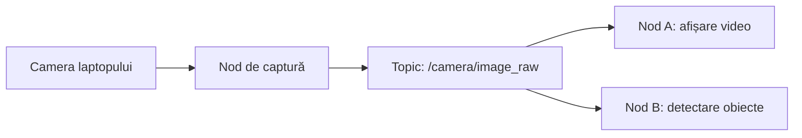
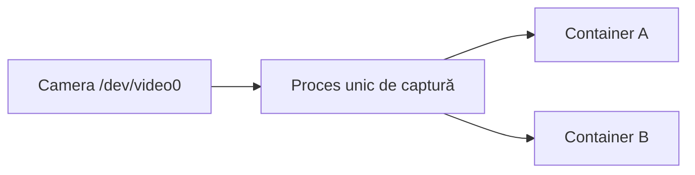
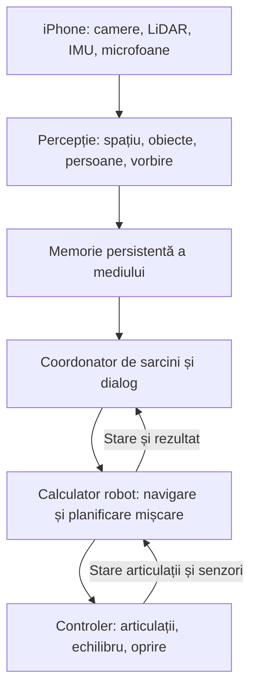

# Verifică distribuirea video ROS 2

ID: `01a10ade-37d0-7f91-95c0-23125e63e891`  
Proiect: 3D.AppleScan  
Export UTC: 2026-10-07T20:11:34.069036+00:00

Mesajele sunt redate integral mai jos. Rezultatele instrumentelor sunt în rezultate.md și istoric.json. Fișierele recuperate sunt în fisiere/.

## Utilizator

In ROS 2 putem sa avem doi consumatori - doiua noduri consumatoare la un nod de camera - exemplu pe un laptop avem camera laptopului - o montam fluxul de ROS2 nodul care sa publice fluxul video si doi sa consume fluxul ? se poate in orice conditii sau nu si daca nu in ce conditii ? si daca sunt suspiciuni de probleme dien ce caurza ?


## Asistent

Verific documentația ROS 2 pentru condițiile de conectare, QoS și posibilele probleme când două noduri consumă același flux video.


## Asistent

**Da, se poate. Un nod ROS 2 poate publica imaginile camerei, iar două sau mai multe noduri le pot primi simultan.** Este o utilizare normală a comunicării prin *topic*. Fiecare abonat poate primi fiecare cadru; cadrele nu se împart automat între consumatori. [Documentația ROS 2 despre topics](https://github.com/ros2/ros2_documentation/blob/jazzy/source/Concepts/Basic/About-Topics.rst)

Pentru exemplul tău, arhitectura este:



**Doar nodul de captură deschide camera fizică.** Nodurile A și B se abonează la topic. Dacă ambele încearcă să deschidă direct camera, posibilitatea de acces simultan depinde de sistemul de operare și de driver; pot apărea conflicte.

Funcționează însă **în anumite condiții, fără o garanție universală de performanță**:

| Condiție | Ce trebuie verificat |
|---|---|
| Același topic și tip de mesaj | Ambele noduri ascultă, de exemplu, `/camera/image_raw`, cu tipul `sensor_msgs/msg/Image`. |
| Nodurile se pot descoperi și comunica | În configurația DDS uzuală: același `ROS_DOMAIN_ID` și setări de comunicație compatibile. Docker, WSL sau calculatoarele separate pot necesita configurare suplimentară. |
| QoS compatibil | Regulile de livrare solicitate de fiecare consumator trebuie să fie compatibile cu cele oferite de publisher. |
| Resurse suficiente | Captura, transportul și procesarea trebuie să încapă în capacitatea procesorului, memoriei și, dacă este cazul, rețelei. |

Tipul mesajelor și domeniul de comunicație sunt documentate în [tutorialul despre topics](https://github.com/ros2/ros2_documentation/blob/jazzy/source/Tutorials/Beginner-CLI-Tools/Understanding-ROS2-Topics/Understanding-ROS2-Topics.rst) și în [configurarea mediului ROS 2](https://github.com/ros2/ros2_documentation/blob/rolling/source/Get-Started/Configuring-ROS2-Environment.rst).

**O cauză frecventă pentru „un consumator merge, celălalt nu” este QoS.** În implementările bazate pe DDS:

| Publisher cameră | Consumator | Compatibilitate pentru reliability |
|---|---|---|
| `best_effort` | `best_effort` | Da |
| `best_effort` | `reliable` | **Nu** |
| `reliable` | `best_effort` | Da |
| `reliable` | `reliable` | Da |

Mai trebuie să fie compatibile și celelalte politici relevante. Incompatibilitatea unui consumator nu împiedică, prin ea însăși, conectarea celuilalt. Pentru video live, profilul `SensorDataQoS` este un punct de pornire când accepți pierderea unor cadre pentru a primi imagini recente. [Documentația QoS](https://repo.test.ros2.org/en/galactic/Concepts/About-Quality-of-Service-Settings.html)

**Dacă apar probleme, simptomele ajută la identificarea cauzei:**

- **Un nod nu primește nimic:** verifică întâi QoS, numele complet al topicului și tipul mesajului.
- **Imaginea ajunge cu întârziere tot mai mare:** procesarea poate fi mai lentă decât captura, iar cadrele se acumulează în cozi. La 30 FPS ai aproximativ 33 ms între cadre; o procesare secvențială de 100 ms/cadru nu poate ține ritmul.
- **Pornirea celui de-al doilea consumator încetinește sistemul:** suspectează CPU/GPU saturat, copii suplimentare ale imaginilor, memorie sau transport. Un consumator lent poate influența și publisherul prin mecanismele de livrare și limitele de resurse; efectul depinde de middleware și configurație.
- **Local merge, prin Wi-Fi se întrerupe:** verifică volumul de date, pierderile de pachete și configurarea rețelei. ROS 2 documentează probleme de fragmentare și buffere la mesaje mari. [Ghidul DDS](https://github.com/ros2/ros2_documentation/blob/jazzy/source/How-To-Guides/DDS-tuning.rst)

Ca ordin de mărime, **1920 × 1080, RGB, 30 FPS înseamnă aproximativ 187 MB/s de imagini necomprimate**, înainte de costurile transportului. Doi consumatori adaugă costuri, dar nu înseamnă obligatoriu dublarea traficului pe rețeaua fizică: depinde unde rulează și ce transport folosesc.

Pentru verificarea inițială:

```bash
ros2 topic info /camera/image_raw --verbose
ros2 topic hz /camera/image_raw
```

Prima comandă arată publisherii, abonații și QoS; a doua măsoară rata observată de propriul abonat de diagnostic. **Prezența a două abonamente nu dovedește că ambele procesează cadrele**: verifică și numărul de cadre și timestampurile în fiecare consumator. [Instrumentele ROS 2](https://github.com/ros2/ros2_documentation/blob/jazzy/source/Tutorials/Beginner-CLI-Tools/Understanding-ROS2-Topics/Understanding-ROS2-Topics.rst)

În configurația ta, cele trei noduri ar rula toate pe același laptop? Și folosești ROS 2 pe Linux, Windows sau WSL?

## Utilizator

daca doua containere docker se abonmeaza la aceeasi camera prin acelasi port fara ros2 camera avand un port de genul v... neavand ros2 in ea e o problema se pot porni doua conatinere simultan si in ambele sa fie map[ata camera sau unul dintre ele va ramane automatfara acces la camera


## Asistent

Verific cazul unei camere mapate ca `/dev/video0` în două containere Docker; aici accesul este controlat de driverul camerei.


## Asistent

**Da, poți porni două containere cu aceeași cameră mapată, dar asta nu înseamnă că ambele pot captura simultan imagini de la ea.**

Presupun că te referi la **`/dev/video0` pe Linux**. Acesta este un dispozitiv, nu un port de rețea.

Docker permite expunerea dispozitivului în containere prin:

```bash
--device=/dev/video0:/dev/video0
```

Maparea oferă acces la aceeași cameră fizică; **nu creează două copii ale fluxului video**. [Documentația Docker](https://docs.docker.com/reference/cli/docker/container/run/#device)

În cazul obișnuit al unei camere accesate direct prin V4L2:

| Acțiune | Ce se întâmplă |
|---|---|
| Pornești ambele containere cu camera mapată | Ambele pot porni și pot vedea dispozitivul. |
| Aplicația din A inițializează captura | Obține resursele necesare capturii. |
| Aplicația din B încearcă aceeași captură | În mod normal, primește `Device or resource busy` / `EBUSY`. |
| A eliberează camera | B poate încerca din nou; reluarea automată depinde de aplicație. |

**Contează cine inițializează primul captura, nu cine pornește primul containerul.** Dacă pornesc simultan, rezultatul poate varia. V4L2 poate permite deschiderea dispozitivului de mai multe aplicații, dar rezervă resursele fluxului aplicației care le alocă prima. [Documentația Linux V4L2](https://cdn.kernel.org/doc/html/latest/userspace-api/media/v4l/open.html)

Prin urmare, celălalt container **nu pierde automat maparea camerei**: o vede în continuare, dar aplicația sa nu poate începe captura. Dacă aplicația se închide din cauza erorii, se poate opri și containerul.

Pentru două aplicații care au nevoie de aceleași imagini, soluția este **un singur proces care capturează și distribuie fluxul către ambele**:



Distribuirea poate fi făcută prin ROS 2 sau printr-un server video care acceptă mai mulți clienți. **Camera nu trebuie să aibă ROS 2 în ea**: programul care citește camera poate publica imaginile în ROS 2.

Dacă prin „port” te referi, în schimb, la o adresă de cameră IP precum `rtsp://...:554/...`, situația diferă: două containere pot fi clienți ai aceluiași server, dacă acesta permite conexiuni simultane.

## Utilizator

Daca device ul este de tip file system avem aceasi problema ca si la viodeo ?


## Asistent

Verific diferența dintre un fișier sau director partajat și un dispozitiv accesat prin `/dev`, fiindcă regulile de acces simultan sunt diferite.


## Asistent

**Nu, dacă te referi la fișiere sau directoare obișnuite, partajate între două containere.** Ambele pot accesa simultan același volum; primul container nu îl rezervă automat. [Documentația Docker](https://docs.docker.com/engine/storage/volumes/)

**Distincția importantă este ce reprezintă acea cale.** În Linux, `/dev/video0` apare în sistemul de fișiere, dar este un **fișier special care comunică cu driverul camerei**, nu un fișier obișnuit cu date salvate. Regulile de acces sunt stabilite de driver. [Tipurile de fișiere Linux](https://www.man7.org/linux/man-pages/man7/inode.7.html)

| Ce accesează cele două containere | Ce se întâmplă |
|---|---|
| Același fișier salvat, doar pentru citire | Ambele îl pot citi integral, independent. |
| Același director, dar scriu în fișiere diferite | În mod normal, funcționează simultan, dacă au permisiuni. |
| Același fișier, ambele scriu | Necesită coordonare: pot suprascrie modificările celeilalte aplicații sau amesteca datele. |
| Unul scrie un fișier, celălalt îl citește | Cititorul poate vedea date incomplete dacă aplicațiile nu coordonează publicarea fișierului. |
| Același `/dev/video0`, ambele capturează | Apare restricția driverului discutată anterior. |

De exemplu, **două containere pot citi simultan același `film.mp4`**, fiecare cu propria poziție de redare. Citirea unuia nu „consumă” datele pentru celălalt.

Dacă însă este un **FIFO / named pipe**, chiar dacă are o cale în filesystem, datele citite se consumă: doi cititori nu primesc automat fiecare câte o copie a fluxului. [Documentația FIFO](https://www.man7.org/linux/man-pages/man7/fifo.7.html)

Te referi la un **director/volum cu fișiere**, la un **disc precum `/dev/sda`** sau la un **dispozitiv care apare ca fișier în `/dev`**? O cale concretă ar lămuri exact cazul.

## Utilizator

daca deviceul video nu il rezerv exclusiv nu putem accesa doi simultan ?


## Asistent

**Poți permite ca două aplicații să deschidă camera, dar asta nu înseamnă că ambele pot captura simultan același flux.** Pentru o cameră obișnuită accesată prin `/dev/video0`, exclusivitatea capturii este impusă de driver, chiar dacă tu nu ceri explicit acces exclusiv.

În V4L2, lucrurile se întâmplă în două etape:

1. **Deschiderea dispozitivului:** ambele aplicații pot executa `open("/dev/video0", ...)`, dacă driverul permite.
2. **Pregătirea capturii:** când una alocă bufferele pentru imagini, devine proprietara resurselor fluxului. Cealaltă nu mai poate aloca acele resurse pentru propria captură și primește, în mod normal, `EBUSY`.

Prin urmare, **absența unui „lock” în codul tău nu elimină rezervarea făcută de driver**. Documentația V4L2 face explicit această distincție și recomandă distribuirea aceluiași flux printr-o aplicație intermediară. [Documentația Linux V4L2](https://cdn.kernel.org/doc/html/latest/userspace-api/media/v4l/open.html)

Accesul simultan poate funcționa pentru operații diferite — de exemplu, o aplicație capturează și alta consultă sau modifică anumite controale ale camerei. Pentru **doi cititori ai acelorași imagini**, ai nevoie de suport explicit pentru distribuire; simpla deschidere fără exclusivitate nu îl creează.

În cazul celor două containere, soluția este:

**Camera → un proces de captură → distribuirea imaginilor către ambele containere.**

Procesul de captură poate rula pe gazdă sau într-un container și poate distribui imaginile cu sau fără ROS 2.

## Utilizator

deci as putea scrie un driver care sa permita ?


## Asistent

**Da, tehnic ai putea scrie un driver care să permită două aplicații să primească simultan imaginile aceleiași camere.** Restricția nu este o imposibilitate hardware universală; depinde de modul în care driverul gestionează captura și distribuirea datelor.

Driverul ar trebui să:

- captureze imaginile de la cameră **o singură dată**;
- ofere fiecărui cititor propria coadă de cadre;
- gestioneze cititorii lenți: pierde cadre pentru ei sau păstrează datele în limita memoriei disponibile;
- stabilească cine controlează rezoluția, FPS-ul și expunerea, deoarece acestea afectează camera comună.

**Simpla eliminare a verificării „device busy” nu este suficientă.** Fără distribuire și sincronizare, cele două aplicații pot intra în conflict asupra bufferelor sau comenzilor camerei.

Pentru Linux există însă o precizare: **modelul standard V4L2 recomandă ca distribuirea aceluiași flux către mai multe aplicații să fie făcută într-un proces intermediar**, nu prin duplicarea fluxului în driver. Un driver care schimbă aceste reguli trebuie să țină cont și de compatibilitatea cu aplicațiile existente. [Documentația V4L2](https://cdn.kernel.org/doc/html/latest/userspace-api/media/v4l/open.html)

Pentru cele două containere ale tale, poți obține același rezultat mai simplu cu un **serviciu de captură și distribuire**, fără să modifici driverul. Dacă aplicațiile acceptă obligatoriu doar `/dev/video…`, serviciul poate alimenta **două dispozitive video virtuale**, câte unul pentru fiecare container.

## Utilizator

Ai acces in GitHub la aplicația 3DScan ? https://github.com/covaciugnm/EVA-3DScan-MAC?

## Asistent

Verific dacă pot accesa repository-ul din GitHub și dacă proiectul local este conectat la el.


## Asistent

**Da, am acces** la repository-ul privat [covaciugnm/EVA-3DScan-MAC](https://github.com/covaciugnm/EVA-3DScan-MAC), prin conexiunea GitHub.

Am verificat permisiunile: pot citi și modifica repository-ul, inclusiv crea branch-uri și pull request-uri. Nu am modificat nimic.

## Utilizator

Citește documentația actuală de pe zona de funcționare în mod robot și codul urcat - și fă o listă de propuneri de îmbunătățit proiectul.
Este gândit să folosim aplicația ca și cap / creier / vision pe un robot humanoid pe un Telefon iPhone 18 pro max 1 TB în așa fel încât să putem scana camere / scana obiecte / naviga prin camere / păstra arhitectura camerelor / poziția obiectelor în spațiul camerei / poziția 3D și 6D pentru a le putea utiliza cu robotul humanoid / să putem urca în program URDF - ul robotului - XACRO și alte descrieri care să ne permită să navigăm și să utilizăm robotul pentru taskuri / face recognition / speech recognition - să recunoaștem și cine vorbește după voce / gesture recognition tot ce putem utiliza telefonul la maxim de funcții disponibile - LLM / STT / TTS / Navigare / identificare 2D a obiectelor - corelare cu obiectele vecine să știm ca sunt în același context și obiecte poziție

## Asistent

Voi citi documentația despre modul robot și codul din repository, apoi voi prioritiza îmbunătățirile pentru scanare, memorie spațială, percepție și controlul humanoidului. Voi separa funcțiile deja implementate de cele planificate și voi verifica limitele platformei iPhone relevante pentru această arhitectură.


## Asistent

GitHub raportează că repository-ul covaciugnm/EVA-3DScan-MAC este gol: nu are fișiere sau branch-uri. În ce repository ori director se află codul și documentația modului robot pe care vrei să le analizez?

## Asistent

Am confirmat accesul la GitHub, dar repository-ul indicat este momentan gol: API-ul nu găsește fișiere și returnează zero branch-uri. Până identificăm sursa codului, pot verifica arhitectura propusă și limitările platformei; recomandările rezultate vor fi preliminare, fără a le prezenta drept constatări din cod.


## Asistent

**Recomand direcția „iPhone pentru percepție, memorie spațială și coordonarea sarcinilor”, cu un controler dedicat pentru mișcarea humanoidului.** Telefonul poate fi componenta principală de interacțiune și înțelegere a mediului, însă echilibrul, controlul articulațiilor și reacția la pierderea comunicației trebuie gestionate local pe robot.

**Analiza codului este deocamdată blocată:** repository-ul [EVA-3DScan-MAC](https://github.com/covaciugnm/EVA-3DScan-MAC) răspunde explicit „This repository is empty”, iar lista branch-urilor este goală. Directorul de rețea al proiectului nu a putut fi citit din această sesiune. Accesul GitHub confirmat anterior reprezenta permisiunile asupra repository-ului, nu confirmarea existenței codului.

Mai jos sunt **propuneri preliminare bazate pe obiectivul tău și documentația platformelor**, nu constatări despre implementarea actuală.

**1. P0 — Separarea responsabilităților între telefon și corpul robotului**

Aș organiza sistemul astfel:



LLM-ul ar selecta acțiuni precum „caută obiectul”, „apropie-te” sau „prinde”, iar executarea ar trece prin verificări geometrice și controlere dedicate. La pierderea telefonului sau a rețelei, robotul trebuie să poată ajunge singur într-o stare sigură.

**2. P0 — Un singur sistem de captură, cu mai mulți consumatori**

În continuarea discuției despre camere: modulele de navigare, recunoaștere și scanare ar trebui să primească date dintr-un serviciu comun de captură.

Fiecare observație trebuie să includă imaginea, adâncimea disponibilă, calibrarea, poziția camerei, timestampul și calitatea urmăririi. Consumatorii lenți trebuie să aibă cozi limitate, fără să întârzie navigarea.

Nu aș presupune că toate camerele și toate modurile ARKit/AVFoundation funcționează simultan. Compatibilitatea combinațiilor trebuie măsurată pe dispozitiv; Apple expune explicit costuri hardware și de presiune asupra sistemului pentru captură multicameră. [AVCaptureMultiCamSession](https://developer.apple.com/documentation/avfoundation/avcapturemulticamsession/hardwarecost)

**3. P0 — Calibrare între telefon, cap, corp și mâini**

Aceasta este fundația pentru folosirea obiectelor detectate de către robot.

Trebuie definite transformările dintre:

- harta încăperii și corpul robotului;
- corp, articulațiile gâtului și telefon;
- telefon, camere și senzorul de adâncime;
- corp, brațe și dispozitivele de prindere.

Dacă robotul mișcă gâtul, transformarea cameră–corp se schimbă și trebuie calculată din pozițiile articulațiilor, sincronizate cu imaginile. Coordonatele și unitățile Apple trebuie convertite explicit în convențiile robotului. Aș folosi convențiile ROS pentru `map`, `odom` și `base_link`. [REP 105](https://reps.openrobotics.org/rep-0105/)

**4. P0 — Memorie spațială persistentă, cu mai multe reprezentări**

Aș păstra separat:

| Reprezentare | Utilizare |
|---|---|
| Structura clădirii: camere, pereți, uși | Organizarea și legăturile dintre încăperi |
| Geometrie 3D | Suprafețe și verificarea coliziunilor |
| Hartă de navigare | Spațiu liber, obstacole, zone interzise |
| Registrul obiectelor | Identitate, poziție, istoric și relații |
| Date pentru relocalizare | Recunoașterea poziției după repornire |

RoomPlan poate combina scanări ale mai multor camere, iar ARKit oferă salvarea și restaurarea hărții pentru relocalizare. Acestea sunt componente utile, dar trebuie completate cu modelul persistent al aplicației și tratarea cazurilor când relocalizarea eșuează. [RoomPlan](https://developer.apple.com/documentation/roomplan/scanning-the-rooms-of-a-single-structure), [ARKit](https://developer.apple.com/documentation/ARKit/managing-session-life-cycle-and-tracking-quality)

**5. P1 — Identitate persistentă pentru fiecare obiect**

„Detectez o cană” și „recunosc aceeași cană de ieri” sunt funcții diferite.

Pentru fiecare obiect aș salva un identificator stabil, clasa, descrierea vizuală, dimensiunile, camera, poziția, ultima observație și nivelul de încredere. Aș distinge explicit între stările **observat acum**, **ultima poziție cunoscută**, **mutat** și **poziție necunoscută**.

Un obiect care nu mai este vizibil nu trebuie șters imediat, iar poziția sa veche nu trebuie tratată automat ca poziție actuală.

**6. P1 — Legarea detecției 2D de poziția 3D și postura 6D**

Fluxul propus:

**detecție/segmentare 2D → adâncime aliniată → puncte 3D → asociere cu obiectul persistent → estimarea orientării.**

Poziția 3D înseamnă `x, y, z`; postura 6D adaugă orientarea. Pentru stocare aș folosi poziție și quaternion, împreună cu incertitudinea estimării.

O casetă 2D și adâncimea centrului nu oferă automat orientarea completă a obiectului. Pentru manipulare sunt necesare modele, observații multiple sau algoritmi specializați; obiectele simetrice pot avea orientări ambigue. FoundationPose este un exemplu de abordare de evaluat pe un calculator potrivit, fără a presupune că implementarea existentă rulează direct pe iPhone. [FoundationPose](https://github.com/NVlabs/FoundationPose)

**7. P1 — Relații între obiecte, nu doar distanțe**

Aș introduce un **graf al scenei**: obiectele sunt entități, iar relațiile descriu contextul.

Exemplu: „cana este pe masă; masa este în bucătărie; cana este lângă farfurie”.

Relațiile utile includ „pe”, „în”, „sub”, „lângă”, „ținut de” și „blochează”. Fiecare relație trebuie să aibă momentul observației și încrederea asociată. Apropierea geometrică este un indiciu, nu dovada că două obiecte au aceeași utilizare.

Această structură permite comenzi precum: **„adu cana de lângă farfurie, de pe masa din bucătărie”**.

**8. P0 — Importul robotului ca pachet complet**

Aș propune importul unui pachet cu URDF/XACRO, mesh-uri, limite articulare, geometrie de coliziune, configurația dispozitivelor de prindere și calibrarea telefonului.

XACRO trebuie procesat într-un mediu controlat pentru a produce URDF. Importul trebuie validat: unități, fișiere lipsă, articulații, limite și arbore cinematic.

**URDF-ul singur nu conferă robotului capacitatea de mers sau de prindere.** Pentru manipulare sunt necesare și grupuri de planificare, cinematică și integrarea controlerelor; SRDF completează descrierea URDF în MoveIt. [URDF și SRDF](https://moveit.picknik.ai/main/doc/examples/urdf_srdf/urdf_srdf_tutorial.html)

**9. P1 — Navigare adaptată unui humanoid**

Aș separa traseul dintre camere, evitarea locală a obstacolelor și planificarea pașilor/echilibrului.

Trebuie considerate atât picioarele, cât și volumul corpului, brațele și obiectele transportate. O hartă 2D poate permite trecerea pe sub o masă, deși capul robotului nu încape. Pentru trepte și denivelări este necesară și evaluarea suprafețelor de sprijin.

Nav2 poate contribui la navigare, dar trebuie integrat cu locomotia humanoidului și cu reprezentarea corectă a geometriei sale. [Reprezentarea mediului în Nav2](https://docs.nav2.org/jazzy/getting_started/navigation_concepts/environmental_representation/)

**10. P1 — Identificarea persoanelor și a vorbitorului ca funcții distincte**

Aș separa:

- detectarea și urmărirea persoanei;
- identificarea facială a persoanelor înregistrate;
- STT: ce s-a spus;
- separarea vorbitorilor: cine vorbește când;
- identificarea vocală: cărei persoane cunoscute îi aparține vocea;
- asocierea persoanei vizibile cu vocea.

**Face ID nu oferă aplicației baza de fețe a telefonului.** Identificarea persoanelor necesită un mecanism propriu de înregistrare și comparare, cu posibilitatea rezultatului „necunoscut”. [Apple — Face ID](https://support.apple.com/en-us/102381)

Pentru STT aș evalua SpeechAnalyzer, verificând separat suportul limbii române, funcționarea offline și rezultatele în zgomotul motoarelor. Pentru dialog: TTS, anularea ecoului și posibilitatea ca utilizatorul să întrerupă robotul. [SpeechAnalyzer](https://developer.apple.com/videos/play/wwdc2025/277/)

**11. P2 — Gesturi legate de obiectele din scenă**

Aș începe cu gesturi clare: oprire, chemare și indicarea unui obiect. Vision oferă detectarea pozițiilor corpului și mâinilor; interpretarea gesturilor rămâne logica aplicației. [Apple Vision](https://developer.apple.com/documentation/Vision/detecting-human-body-poses-in-images)

Funcția valoroasă este combinarea: **„adu-mi acela” + direcția mâinii + obiectele vizibile**. Dacă sunt mai mulți candidați, robotul trebuie să clarifice alegerea.

**12. P0 — Buget de procesare și teste susținute pe telefon**

Configurația iPhone 18 Pro Max de 1 TB și senzorul LiDAR apar în specificațiile Apple. Totuși, **1 TB reprezintă stocarea, nu memoria disponibilă modelelor AI**. [Specificațiile Apple](https://www.apple.com/iphone-18-pro/specs/)

Aș introduce moduri explicite: scanare detaliată, navigare, conversație și manipulare. Fiecare are alte priorități de rezoluție și procesare. Alegerea LLM-ului local și a sarcinilor transferate unui calculator extern trebuie făcută după măsurători.

Aș testa minimum: repornire și relocalizare, obiect mutat, pierderea rețelei, persoană care traversează traseul, vorbire peste zgomot și funcționare continuă de 30–60 de minute. Aș înregistra datele sincronizat pentru a reproduce erorile.

**Ordinea recomandată:** captură și calibrare → hartă persistentă și relocalizare → obiecte 3D cu identitate → navigare → manipulare → dialog multimodal avansat.

Pentru analiza efectivă a proiectului rămâne necesar **codul și documentația modului robot într-un repository accesibil sau într-o arhivă atașată**. Pe baza lor, lista poate deveni una concretă: ce există, ce lipsește, ce trebuie refăcut și în ce fișiere.

## Utilizator

https://github.com/covaciugnm/3dscan.eva-org.com

## Asistent

Voi analiza acest repository, începând cu documentația modului robot și codul asociat. Apoi voi revizui propunerile în funcție de ce este deja implementat.


## Asistent

Acest repository conține documentația robotică și codul backend-ului pentru inventar și procesare video. Am găsit și o diferență importantă: documentația descrie un preview pe iPhone, dar fișierele Swift la care trimite nu apar în versiunea urcată. Verific acum ce funcții pot confirma din cod și unde documentația a rămas în urmă.


## Asistent

Am găsit aplicația iPhone pe branch-ul separat `app`; `main` conține site-ul și dosarul de arhitectură. Pot verifica acum și codul Swift pentru modul robot, recunoașterea facială, voce și inventar. Documentația din `main` pare mai veche decât aplicația, deci voi ține cont de ambele versiuni.


## Asistent

Am găsit câteva probleme concrete care merită rezolvate înainte de extinderea funcțiilor: coordonatele obiectelor și reperul declarat în mesajele ROS nu coincid, iar sincronizarea inventarului poate rata modificări făcute offline. Verific acum legătura dintre percepția live, harta persistentă și comenzile robotului, ca propunerile să pornească de la ce există deja în cod.

## Asistent

Aplicația are deja inventar spațial, potrivire după obiectele vecine, recunoaștere facială, STT/TTS și conectare la LLM. Principalul pas următor este unificarea acestor module: modul robot trebuie să folosească aceeași hartă și aceleași identități persistente ale obiectelor. Am verificat și că estimările numite „6D” includ încă orientări și dimensiuni aproximative, deci au nevoie de validare suplimentară pentru prinderea obiectelor.

## Asistent

Da, am acces la **[covaciugnm/3dscan.eva-org.com](https://github.com/covaciugnm/3dscan.eva-org.com)** și am citit documentația robotică împreună cu implementările relevante:

- **`main`, commit `98abc15`**: documentație, arhitectură, site, backend și procesare video.
- **`app`, commit `0e71d84`**: aplicația Swift, percepție, inventar, bridge, recunoaștere facială și voce.

**Concluzia mea: proiectul are deja componente utile pentru rolul de cap perceptiv și coordonator al unui humanoid. Prioritatea este să le conectați într-un sistem cu poziții, identități și timp coerente.** În cod există câteva probleme care trebuie corectate înainte ca robotul să folosească observațiile pentru deplasare sau manipulare.

Aceasta este o analiză statică a codului și documentației. Nu am compilat aplicația și nu am validat comportamentul pe iPhone sau pe robot.

**Ce există deja**

| Funcție | Situația observată |
|---|---|
| Percepție în mod robot | ARKit, adâncime, segmentare geometrică, detecție neurală și urmărire temporară |
| Inventar persistent | Camere, obiecte, poziții XYZ, fotografii, istoric și salvarea hărții AR |
| Corelare cu vecinii | Există deja în `InventoryMatcher`: distanță, dimensiuni și clasele obiectelor apropiate |
| Recunoaștere facială | Mai multe motoare și salut automat în modul robot |
| Voce | STT și TTS implementate |
| LLM | Conectori HTTP și asistent care primește context din inventar |
| Comunicație robot | Bridge TCP cu telemetrie JSON și mai mulți clienți |
| Înregistrare | Jurnal persistent al telemetriei robotului |
| URDF/XACRO și execuție robotică | Documentate; importatorul aplicației verificat este pentru OBJ/USDZ |

Mai jos este lista mea de îmbunătățiri, în ordinea în care le-aș aborda.

**1. P0 — Corectarea reperelor coordonatelor transmise robotului**

Am găsit o neconcordanță directă: motorul calculează pozițiile obiectelor în **spațiul lumii ARKit**, apoi le serializează fără schimbarea reperului. Mesajul declară însă `iphone_camera_optical_frame`.

Un consumator ROS care respectă acest `frame_id` poate transforma greșit poziția obiectului. Problema devine evidentă când telefonul se mișcă.

Propun un contract unic, aplicat în cod:

- observații în reperul optic, transformate folosind poziția camerei **la captură**; sau
- obiecte în reperul lumii, cu identificarea explicită a acelei hărți și a versiunii sale.

Conversia axelor ARKit–ROS trebuie verificată prin teste numerice. Documentația proiectului descrie deja corect această necesitate; implementarea trebuie aliniată cu ea. Surse: [calculul poziției în lume](https://github.com/covaciugnm/3dscan.eva-org.com/blob/0e71d84abeb603db4daf81c5917bab58d36dd728/EVA-3DScan/Core/Robot/RobotPerceptionEngine.swift#L689), [reperul declarat](https://github.com/covaciugnm/3dscan.eva-org.com/blob/0e71d84abeb603db4daf81c5917bab58d36dd728/EVA-3DScan/Core/Robot/RobotTelemetry.swift#L156).

**2. P0 — Separarea timpului capturii de timpul procesării și tratarea repornirilor**

Poziția telefonului primește timestamp-ul momentului publicării, deși provine dintr-un cadru capturat anterior. La mișcarea capului, această diferență afectează transformarea observațiilor.

În plus, START resetează tracking-ul AR și secvența mesajelor, dar păstrează identificatorul sesiunii și registrul obiectelor. Astfel pot apărea secvențe repetate și obiecte vechi într-o origine spațială nouă.

Propun:

- propagarea `ARFrame.timestamp` până la consumator;
- identificatori separați pentru sesiune, ceas și originea hărții;
- invalidarea rezultatelor asincrone aparținând unei sesiuni anterioare;
- sincronizarea ceasului telefonului cu robotul;
- respingerea observațiilor prea vechi.

Există și o problemă asociată: `mergeNeural` poate actualiza timpul ultimei observații fără să actualizeze poziția track-ului existent. Poziția veche poate părea astfel proaspăt măsurată. Surse: [ciclul sesiunii și timestamp-uri](https://github.com/covaciugnm/3dscan.eva-org.com/blob/0e71d84abeb603db4daf81c5917bab58d36dd728/EVA-3DScan/Core/Robot/RobotPerceptionEngine.swift#L254), [actualizarea neurală](https://github.com/covaciugnm/3dscan.eva-org.com/blob/0e71d84abeb603db4daf81c5917bab58d36dd728/EVA-3DScan/Core/Robot/RobotPerceptionEngine.swift#L747).

**3. P0 — Protejarea inventarului când relocalizarea eșuează**

Dacă harta salvată nu poate fi încărcată, aplicația pornește o hartă nouă. Obiectele persistente ale camerei rămân însă disponibile pentru comparație. Butonul „Salvează tot” nu condiționează salvarea de o relocalizare confirmată.

Consecința posibilă: compararea pozițiilor din două origini diferite și salvarea unor mutări false.

Aș introduce o condiție obligatorie în logica de date: **pozițiile persistente pot fi modificate numai după verificarea alinierii cu harta lor**. Dacă harta nu se recuperează, se creează o revizie distinctă sau se face o realiniere explicită.

Separat, obiectele nevăzute sunt marcate `missing` fără verificarea vizibilității. Un obiect din spatele robotului sau ascuns după masă trebuie să rămână „neobservat”, până există dovezi că lipsește. Surse: [încărcarea hărții](https://github.com/covaciugnm/3dscan.eva-org.com/blob/0e71d84abeb603db4daf81c5917bab58d36dd728/EVA-3DScan/Core/Capture/RoomInventorySession.swift#L159), [salvarea inventarului](https://github.com/covaciugnm/3dscan.eva-org.com/blob/0e71d84abeb603db4daf81c5917bab58d36dd728/EVA-3DScan/Features/Inventory/InventoryLiveView.swift#L373), [marcarea obiectelor lipsă](https://github.com/covaciugnm/3dscan.eva-org.com/blob/0e71d84abeb603db4daf81c5917bab58d36dd728/EVA-3DScan/Core/Capture/InventoryMatcher.swift#L215).

**4. P0 — Repararea sincronizării modificărilor offline**

Sincronizarea folosește ora clientului drept cursor, iar serverul filtrează după data modificării trimisă de client.

Exemplu: telefonul A sincronizează la 10:00. Telefonul B a modificat offline un obiect la 09:00 și îl încarcă la 10:05. A cere ulterior modificările de după 10:00, dar înregistrarea lui B păstrează 09:00 și poate fi omisă.

Propun un jurnal de schimbări cu **revizie monotonă atribuită de server**. Ora observației rămâne un câmp separat. Harta, pozițiile și fișierele asociate trebuie sincronizate ca versiuni compatibile.

Unele erori de transfer al fișierelor sunt absorbite cu `try?`; acestea trebuie să rămână în coada de reîncercare și să fie vizibile în starea sincronizării. Surse: [cursorul aplicației](https://github.com/covaciugnm/3dscan.eva-org.com/blob/0e71d84abeb603db4daf81c5917bab58d36dd728/EVA-3DScan/Core/Sync/InventorySyncService.swift#L122), [filtrarea serverului](https://github.com/covaciugnm/3dscan.eva-org.com/blob/98abc15fbdc5b6ee8c746be637a8094db8e6be3b/Site/server/inventory.mjs#L74).

**5. P0 — Definirea exactă a ceea ce înseamnă „poziție 6D”**

În implementarea actuală:

- orientarea obiectelor create prin detectorul neural este identitatea;
- grosimea este aproximată din lățime și înălțime;
- segmentarea geometrică estimează o orientare simplificată.

Aceste rezultate pot susține inventarierea aproximativă. Pentru manipulare trebuie cunoscută validitatea fiecărei componente.

Propun câmpuri explicite pentru poziție, orientare și dimensiuni: **măsurată / estimată / necunoscută**, metoda folosită și incertitudinea. Ulterior: segmentare pe instanță, observații din mai multe unghiuri și aliniere la modelul 3D al obiectului.

Modelul persistent `PlacedObject` trebuie extins cu orientare, reper, versiunea hărții și calibrare; în prezent păstrează XYZ și dimensiuni. Surse: [estimările neurale](https://github.com/covaciugnm/3dscan.eva-org.com/blob/0e71d84abeb603db4daf81c5917bab58d36dd728/EVA-3DScan/Core/Robot/RobotPerceptionEngine.swift#L698), [modelul persistent](https://github.com/covaciugnm/3dscan.eva-org.com/blob/0e71d84abeb603db4daf81c5917bab58d36dd728/EVA-3DScan/Core/Model/InventoryModels.swift#L198).

**6. P0 — Transformarea bridge-ului într-o integrare ROS 2 verificabilă**

Bridge-ul existent permite deja mai mulți consumatori. Are însă transport TCP fără autentificare și trimite fără gestionarea explicită a consumatorilor lenți sau a erorilor de trimitere.

Aș adăuga:

- asociere autentificată telefon–robot și criptare;
- cozi limitate, care păstrează date recente pentru percepție;
- transfer fiabil separat pentru hărți și comenzi;
- confirmări și diagnostic pentru recepție, decodare și utilizare;
- un pachet ROS 2 executabil, cu mesaje și teste de compatibilitate.

Un indicator verde trebuie să distingă „telefonul produce date” de „robotul le primește și le poate folosi”. [Implementarea bridge-ului](https://github.com/covaciugnm/3dscan.eva-org.com/blob/0e71d84abeb603db4daf81c5917bab58d36dd728/EVA-3DScan/Core/Robot/RobotBridge.swift#L107).

**7. P1 — O memorie spațială comună pentru toate modulele**

Aceasta este cea mai importantă extindere de arhitectură.

Modul robot are un registru temporar de obiecte, iar inventarul are camere și obiecte persistente. Aș introduce un serviciu comun care păstrează:

- clădire → etaj → cameră → obiect;
- identitatea stabilă a fiecărui exemplar;
- poziția, orientarea, vechimea și sursa observației;
- relații precum „pe masă”, „în dulap”, „lângă monitor”, „ținut de robot”;
- istoricul schimbărilor și versiunea hărții.

Astfel, „adu cana de lângă monitor” se referă la aceeași cană în percepție, inventar, conversație și planificarea mișcării.

**8. P1 — Îmbunătățirea identității obiectelor și a contextului vecinilor**

Corelarea cu vecinii există deja. Totuși, asocierea actuală folosește un algoritm greedy și nu impune un prag minim al scorului sau o diferență minimă față de al doilea candidat.

Aș adăuga aspect vizual, continuitate temporală, asociere globală și starea „identitate ambiguă”. Relațiile dintre vecini trebuie să includă geometria relativă și suportul fizic, nu doar clasele apropiate.

Test esențial: două scaune identice sunt mutate sau își schimbă locurile. Sistemul trebuie să măsoare câte identități schimbă greșit. [Algoritmul actual](https://github.com/covaciugnm/3dscan.eva-org.com/blob/0e71d84abeb603db4daf81c5917bab58d36dd728/EVA-3DScan/Core/Capture/InventoryMatcher.swift#L146).

**9. P1 — Un singur coordonator al capturii, cu mai mulți consumatori**

Legat și de întrebările tale despre cameră: aș proiecta aplicația cu un proprietar al sesiunii de captură, care distribuie cadre sincronizate către detecție, fețe, gesturi, inventar, înregistrare și bridge.

Fiecare consumator primește propria frecvență și un buget de procesare. Un modul lent nu trebuie să întârzie întregul sistem.

Pentru camere multiple, combinațiile și costul hardware trebuie verificate pe configurația efectivă. Suportul MultiCam nu garantează automat orice combinație de camere și funcții AR. [Documentația Apple](https://developer.apple.com/documentation/avfoundation/avcapturemulticamsession).

**10. P1 — Importul unui profil complet de robot**

Importatorul existent pentru OBJ/USDZ poate servi catalogului de obiecte. Pentru humanoid aș adăuga un pachet separat:

- URDF rezultat din XACRO și toate mesh-urile;
- articulații, limite, inerții și geometrie de coliziune;
- SRDF și grupuri de manipulare;
- configurația controlerelor;
- transformarea calibrată dintre telefon și cap;
- versiunea și amprenta configurației.

Telefonul poate afișa robotul și suprapune observațiile peste el. Calculatorul robotului trebuie să furnizeze pozițiile reale ale articulațiilor și să execute mișcările. URDF/SRDF descriu modelul și semantica necesară planificării; importul lor nu produce singur un controler de mers. [MoveIt: URDF și SRDF](https://moveit.picknik.ai/main/doc/examples/urdf_srdf/urdf_srdf_tutorial.html).

**11. P1 — Separarea hărții camerelor de percepția necesară mersului**

Aș păstra trei reprezentări conectate:

| Reprezentare | Utilizare |
|---|---|
| Structura clădirii | Camere, pereți, uși și trasee globale |
| Geometrie locală actualizată | Obstacole, podea, denivelări și spațiu necunoscut |
| Inventar semantic | Obiecte, persoane, relații și sarcini |

Pentru humanoid trebuie evaluate și suprafețele de sprijin, treptele, gabaritul corpului și obiectele transportate. Harta de navigație trebuie alimentată cu observații recente și cu starea robotului.

Documentația voastră robotică descrie deja această separare și păstrarea echilibrului pe controlerul robotului. Aș transforma aceste cerințe în componente executabile și teste, păstrând responsabilitățile definite acolo.

**12. P1 — Integrarea feței, vocii și gesturilor într-o identitate comună**

Recunoașterea facială și salutul există. Următorul nivel ar trebui să distingă:

- **ce spune persoana** — STT;
- **când vorbește fiecare participant** — diarizare;
- **cine este vorbitorul** — identificare vocală;
- **ce persoană vizibilă corespunde vocii** — asociere audio-video.

Aș adăuga praguri de ambiguitate, confirmare pe mai multe observații și un manager audio comun pentru microfon, TTS, ecou și întreruperea vorbirii robotului.

Corecție concretă: `SpeechService` nu impune `requiresOnDeviceRecognition`. Prin urmare, codul actual nu garantează procesarea exclusiv locală; trebuie verificate capabilitatea și limba, apoi aplicată politica aleasă. [Codul STT](https://github.com/covaciugnm/3dscan.eva-org.com/blob/0e71d84abeb603db4daf81c5917bab58d36dd728/EVA-3DScan/Core/AI/SpeechService.swift#L104), [cerințele Apple](https://developer.apple.com/documentation/speech/sfspeechrecognizer/supportsondevicerecognition).

Pentru gesturi aș începe cu indicarea unui obiect, chemarea robotului și un gest de oprire. Detectarea punctelor mâinii/corpului trebuie urmată de interpretarea gestului în timp și raportarea lui la scena 3D. [Vision pentru mâini și corp](https://developer.apple.com/documentation/Vision/detecting-hand-poses-with-vision).

**13. P1 — Evoluția LLM-ului către sarcini executabile**

Clientul actual întoarce text. Opțiunea `local` desemnează un endpoint HTTP; nu demonstrează inferență pe telefon. [Implementarea LLM](https://github.com/covaciugnm/3dscan.eva-org.com/blob/0e71d84abeb603db4daf81c5917bab58d36dd728/EVA-3DScan/Core/AI/LLMClient.swift#L50).

Propun acțiuni structurate precum `find_object`, `inspect_object`, `navigate_to` și `pick_object`, cu identificatori stabili, condiții de execuție, progres, anulare și verificarea rezultatului.

Exemplu: pentru „adu cana”, sistemul selectează exemplarul, verifică prospețimea poziției, navighează, reobservă obiectul, solicită prinderea și confirmă rezultatul. LLM-ul coordonează intenția; executorul robotic validează fiecare pas.

**14. P0/P1 — Teste funcționale și buget de funcționare continuă**

Fișierul principal de teste Swift verificat conține încă exemplele goale Xcode. Aș folosi înregistrările existente pentru teste reproductibile, completate cu datele senzorilor necesare. [Testele Swift](https://github.com/covaciugnm/3dscan.eva-org.com/blob/0e71d84abeb603db4daf81c5917bab58d36dd728/EVA-3DScanTests/EVA_3DScanTests.swift#L20).

Primele scenarii:

- telefonul se mișcă, obiectul rămâne fix;
- STOP/START și relocalizare;
- hartă absentă sau coruptă;
- două obiecte identice;
- actualizări offline sosite târziu;
- consumator lent și conexiune întreruptă;
- sesiuni prelungite cu percepție, voce și înregistrare simultană.

Pentru iPhone-ul vizat, cei 1 TB ajută arhivarea. Capacitatea de operare continuă trebuie stabilită prin măsurarea latenței, memoriei, temperaturii, consumului și cadrelor pierdute. Aș introduce profiluri adaptive: navigare, inspecție precisă, conversație și scanare.

**Ordinea recomandată de livrare**

1. **Corectitudine:** repere, timestamp-uri, reporniri, relocalizare și sincronizare.
2. **Memorie comună:** identități persistente, relații spațiale și poziții versionate.
3. **Integrare robot:** profil URDF/XACRO, bridge ROS 2, calibrare și simulare.
4. **Sarcină completă demonstrabilă:** recunoaște persoana → înțelege cererea → găsește obiectul → navighează → reobservă → manipulează → confirmă.

Aș folosi această ultimă demonstrație drept reper de dezvoltare: fiecare componentă trebuie să contribuie la o sarcină completă, măsurabilă, realizată pe robot.

## Utilizator

Creaza o echiap de agenti specialisti in iPhone ios software si hardware si un auditor 
traseazale sarcini sa caute tot ce este disponibil in acest moment 
Verifica ca ai ales cele mai moderne si capabile metode de pozitionare / viziune /identificare  - instaleaza mai multe metode daca este nevoie - coreleaza cu prelucrarile de pe server daca este nevoie de ceva softuri instalate peserver sa confirmam imbunatatim - comunicam - pastram informatii - intre mai multi roboti ( telefoane din aceasi camera )
Foloseste la maxim fara nici o retinere toate resursele software posibile 
pune pe telefon tot ce trebuie la maxim si daca se poate ceva mai capabil sa punem pe server sa ajutam ansamblul si echipa

auditeaza rezultatele si nu finaliza pana nu obtii maxim de 10 / 10 de la auditor cu documentatia - pasi - roadmap totul sa fie clar sa trecem apoi in baza documentului la implmentare a proiectului 

Salveaza planul cu data de astazi si toate propunerile 


## Asistent

Voi forma o echipă pentru iOS și hardware iPhone, viziune și localizare, plus un auditor independent. Vom verifica metodele disponibile acum, împărțirea procesării între telefon și server și colaborarea între mai mulți roboți. Voi salva un dosar datat **6 octombrie 2026**, cu propuneri, arhitectură, pași și roadmap pentru implementare. Nota auditorului va evalua calitatea și caracterul implementabil al planului; performanțele pe dispozitive vor avea criterii de testare explicite.


## Utilizator

salveaza versiunile in github intrun folder si auditul lor si versiunea finala 


## Asistent

Voi salva în GitHub un folder `2026-10-06` cu rapoartele specialiștilor, fiecare versiune a planului, auditul aferent și versiunea finală. Voi păstra și istoricul observațiilor rezolvate, astfel încât să fie clar ce a verificat auditorul și ce rămâne de demonstrat în implementare.


## Asistent

Pentru redactarea dosarului folosesc skill-ul `pages:write-page`; destinația rămâne folderul cerut din GitHub. Echipa verifică inclusiv API-urile iOS recente și compatibilitatea lor, pentru a compara soluțiile deja implementate cu alternativele disponibile acum.


## Asistent

Pentru a dimensiona instalările din roadmap: ce model de robot și ce server aveți disponibil (procesor, RAM, placă video și VRAM, sistem de operare)? Dacă nu sunt încă alese, voi include profiluri de server și un pas de măsurare înaintea instalării.

## Asistent

Prima versiune a planului este deja salvată în GitHub și a intrat la audit. Specialiștii au identificat alternative recente pentru tracking de obiecte pe iOS, segmentare și estimare 6D pe server. Pentru fiecare vom consemna suportul real, licența, resursele necesare și testul prin care poate înlocui metoda actuală.


## Asistent

Auditorul a acordat versiunii inițiale **5,5/10**: arhitectura este coerentă, dar lipsesc contractele exacte, pragurile de test și pașii reproductibili de instalare. Completez aceste puncte acum. Versiunea revizuită va preciza și cum împart doi roboți aceeași hartă, cum rezolvă observațiile contradictorii și cum evită executarea simultană a aceleiași sarcini.


## Utilizator

nu tine coont de licientere - pune toate optiunile in amnaliza - noi suntem development deci nu de vanzare reasearch 


## Asistent

Am înțeles: analiza va acoperi și metodele de cercetare, necomerciale sau cu licențe restrictive, fără să le excludă din comparația tehnică. Voi evalua prioritar precizia, capabilitățile, resursele și efortul de integrare. Condițiile de acces și utilizare vor rămâne consemnate pentru etapa instalării.


## Utilizator

incearca sa termini pana la 1% ramas la usage si daca nu salveaza totul sa ramana pana unde am ajuns salvat


## Asistent

Voi verifica usage-ul și voi salva acum și rapoartele, auditul și specificațiile completate. Încerc să închid auditul final înainte de pragul de 1%; dacă ajungem aproape de el, las în GitHub un punct de reluare cu starea exactă, observațiile deschise și pașii rămași.


## Asistent

Checkpoint-ul complet este salvat în GitHub: rapoartele specialiștilor, V1 cu auditul de 5,5/10 și V2 cu contracte, instalare, teste și roadmap. Usage-ul indică acum aproximativ **5% rămas**. Auditorul verifică versiunea înghețată; după verdict voi salva și copia finală, împreună cu amprentele fișierelor verificate.


## Asistent

Auditul versiunii revizuite este încheiat: **10/10 pentru documentația de implementare, fără constatări blocante deschise**. Salvez acum versiunea finală și auditul în GitHub și verific că fișierele publicate coincid cu cele auditate. Nota acoperă planul și pașii de verificare; instalarea și testele pe telefon, server și robot sunt definite ca etapa următoare.


## Asistent

Am terminat și am salvat totul în GitHub, datat **6 octombrie 2026**. La ultima verificare mai erau **4% usage**.

- [Dosarul complet](https://github.com/covaciugnm/3dscan.eva-org.com/tree/main/Aplicație/Extindere-Robotica/Plan_implementare_2026-10-06) — 15 fișiere: rapoarte, versiuni, audituri și amprente SHA256.
- [Planul final](https://github.com/covaciugnm/3dscan.eva-org.com/blob/main/Aplicație/Extindere-Robotica/Plan_implementare_2026-10-06/PLAN_FINAL.md) — telefon, server, colaborare între roboți, **17 sarcini și 15 familii de teste**.
- [Auditul final](https://github.com/covaciugnm/3dscan.eva-org.com/blob/main/Aplicație/Extindere-Robotica/Plan_implementare_2026-10-06/audit-v2.md) — **10/10 pentru documentație**, după remedierea observațiilor din V1, evaluată la 5,5/10.

Am inclus și opțiunile research/necomerciale. Toate fișierele publicate au fost recitite și verificate.

Nota certifică planul, nu performanțe hardware deja obținute. Urmează inventarul concret al serverului și robotului, apoi implementarea corecțiilor prioritare.

## Utilizator

da-mi cheia de acces la github


## Asistent

Nu am acces la tokenul secret folosit de conexiunea GitHub; conectorul îmi permite operații autorizate fără să-mi expună cheia.

Ai nevoie de un **token GitHub (PAT)** pentru API/HTTPS sau de o **cheie SSH** pentru conectarea serverului?
