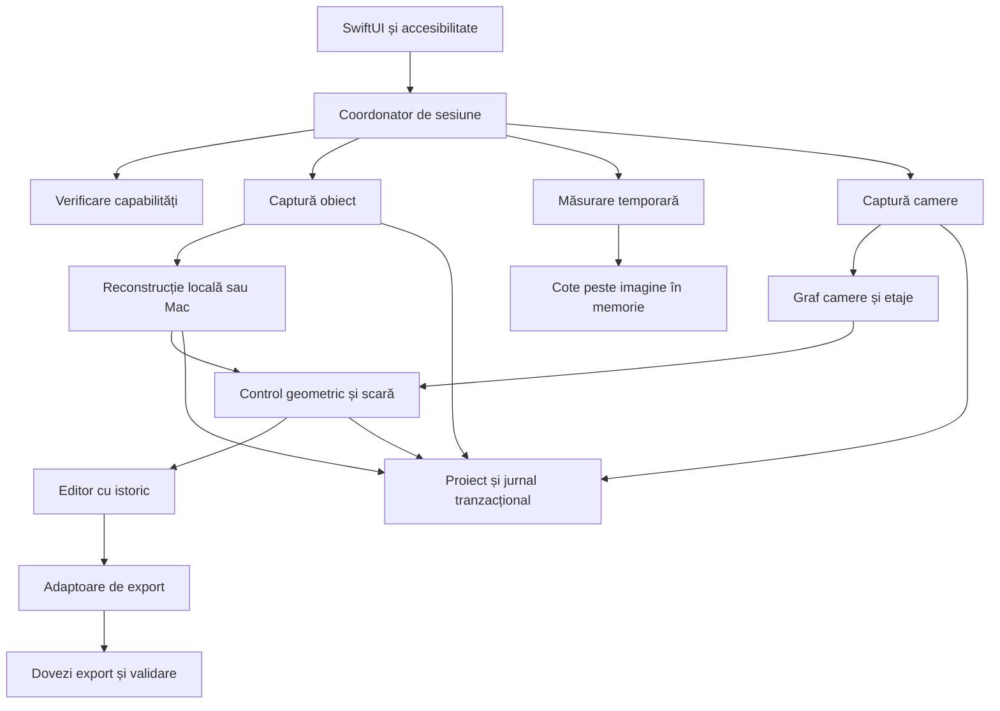
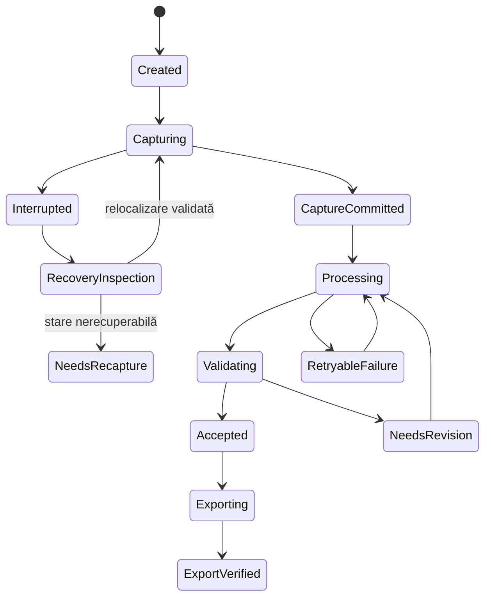

# Arhitectura aplicației iPhone pentru scanare și măsurare 3D

Autor responsabil: agent specialist Apple și arhitectură. Data documentării: 2 octombrie 2026. Stare: proiectare documentată, fără aplicație implementată și fără rezultate experimentale obținute. Destinat managerului, dezvoltatorilor iOS și macOS, specialistului în metrologie și auditorului.

Aplicația propusă folosește trei fluxuri distincte: obiecte cu dimensiuni, măsurare imediată fără păstrarea mediului și camere salvate care formează apartamente sau case. Nucleul recomandat este nativ Swift, SwiftUI, ARKit, RealityKit și RoomPlan, cu procesare locală și un serviciu opțional pe Mac pentru reconstrucții detaliate și conversii. Calitatea geometrică, scara și recuperarea datelor sunt criterii de acceptare explicite.

## 1 Fapte verificate și decizii propuse

**Fapt documentat.** `ARDepthData` furnizează adâncimea față de planul camerei, în metri, plus o hartă a încrederii. Nu este o declarație de incertitudine metrologică în milimetri. [AP-S01](https://developer.apple.com/documentation/arkit/ardepthdata)

**Fapt documentat.** Reconstrucția scenei oferă un mesh estimat; detectarea planurilor poate modifica geometria acestuia. Prin urmare, proiectul păstrează separat datele observate și geometria ajustată. Ultima propoziție este o decizie proprie de proiectare. [AP-S02](https://developer.apple.com/documentation/arkit/arworldtrackingconfiguration/scenereconstruction)

**Fapt documentat.** RoomPlan este disponibil când verificarea `RoomCaptureSession.isSupported` reușește; documentația asociază acest suport cu LiDAR. [AP-S03](https://developer.apple.com/documentation/roomplan/roomcapturesession/issupported)

**Fapt documentat.** `ObjectCaptureSession` conduce achiziția ghidată; reconstrucția este o etapă distinctă, efectuată de `PhotogrammetrySession`. [AP-S04](https://developer.apple.com/documentation/realitykit/objectcapturesession)

**Fapt documentat.** Reconstrucția fotogrammetrică Apple există pe iOS începând cu iOS 17 și pe macOS începând cu macOS 12, pe hardware compatibil. Suportul se verifică pe dispozitiv. [AP-S05](https://developer.apple.com/documentation/realitykit/creating-3d-objects-from-photographs)

**Fapt documentat.** La consultare, iOS oferă numai nivelul `.reduced`; macOS oferă niveluri suplimentare. Un preview cu texturi detaliate nu demonstrează existența aceleiași fineți în geometria imprimabilă. A doua propoziție este interpretarea inginerească a diferenței dintre geometrie și textură. [AP-S06](https://developer.apple.com/documentation/realitykit/photogrammetrysession/request/detail)

**Decizie propusă.** Versiunea minimă de produs este iOS 17, supusă verificării SDK și politicii de suport înaintea implementării. Acesta este un prag de proiect, nu o afirmație despre cerințele curente App Store. Nu se publică o listă de iPhone compatibile numai pe baza denumirii comerciale. Aplicația produce un raport real al capabilităților.

**Decizie propusă.** Funcțiile cu LiDAR sunt nucleul inițial. Pe iPhone fără LiDAR, măsurarea AR pe suprafețe detectate și capturarea fotografiilor pot fi oferite în regim separat. Fotografiile se procesează pe Mac compatibil dacă reconstrucția locală nu este disponibilă. Calitatea și precizia acestui traseu se validează distinct.

## 2 Matricea capabilităților și verificarea la rulare

| Funcție | iPhone cu LiDAR | iPhone fără LiDAR | Mac | Verificare obligatorie și comportament |
|---|---|---|---|---|
| Măsurare AR cu tracking | Candidat | Candidat, validare separată | Nu este flux de captură al produsului | `ARWorldTrackingConfiguration.isSupported`, acces cameră, tracking normal |
| Adâncime LiDAR | Condiționat de API și configurație | Indisponibil | Nu este achiziție LiDAR iPhone | `ARWorldTrackingConfiguration.supportsFrameSemantics(.sceneDepth)` |
| Mesh al mediului | Condiționat | Nu se promite | Prelucrarea datelor importate | `supportsSceneReconstruction(.mesh)`; clasificarea se verifică separat |
| RoomPlan cameră | Condiționat | Indisponibil în fluxul RoomPlan | Vizualizare sau conversie proprie | `RoomCaptureSession.isSupported` și disponibilitatea API |
| RoomPlan mai multe camere | Condiționat de coordonate compatibile | Indisponibil în acest flux | Postprocesare proprie a exporturilor | Disponibilitatea `StructureBuilder`, verificarea sistemului comun |
| Captură ghidată Object Capture | Condiționat | Nu se presupune suport | Nu înlocuiește capturarea mobilă | `ObjectCaptureSession.isSupported` separat de reconstrucție |
| Reconstrucție Object Capture | `.reduced` pe dispozitive compatibile | Nu se presupune suport | Mai multe niveluri pe hardware compatibil | `PhotogrammetrySession.isSupported` |
| Număr maxim de imagini | Citit din API | Depinde de procesorul ales | Citit din API | `PhotogrammetrySession.Limits`; fără număr fix universal |
| Cloud de puncte LiDAR densificat | Implementare proprie peste depth | Nu din LiDAR | Procesare/import | Nu se confundă cu norul rar fotogrammetric |
| DWG | Adaptor propriu sau serviciu licențiat | Același principiu | Conversie dedicată | Nu este export nativ promis de RoomPlan |
| STL și 3MF imprimabile | Procesare proprie și validare | Din model importat/reconstruit | Procesare proprie | Nu se deduce imprimabilitatea din existența USDZ |

Surse pentru API și separarea platformelor: [AP-S07](https://developer.apple.com/documentation/arkit/arconfiguration/supportsframesemantics(_:)), [AP-S08](https://developer.apple.com/documentation/realitykit/photogrammetrysession/limits-swift.struct), [AP-S09](https://developer.apple.com/documentation/realitykit/photogrammetrysession/issupported), [AP-S10](https://developer.apple.com/documentation/roomplan/structurebuilder/capturedstructure(from:)). Restul coloanelor exprimă limitele și deciziile produsului propus.

Raportul de capabilități include model hardware, versiune OS și build, versiune aplicație și algoritmi, rezultate booleene ale verificărilor, limite imagini, spațiu disponibil, stare termică, permisiuni și lista funcțiilor activate. Se salvează odată cu proiectul și cu fiecare reconstrucție. `#available` verifică existența API; `isSupported` verifică hardware-ul. Niciuna nu înlocuiește tratarea erorilor de execuție.

### 2.1 Etaje și dimensiunea clădirilor

**Fapte cu contexte diferite.** WWDC23 recomanda utilizarea MultiRoom pentru locuințe pe un nivel, circa 186 m² în total și iluminare de cel puțin 50 lux. Documentația consultată în 2026 afirmă că structurile pot cuprinde camere la înălțimi diferite și pe etaje diferite. Acestea nu trebuie prezentate ca o interdicție actuală privind etajele. [AP-S11](https://developer.apple.com/videos/play/wwdc2023/10192/), [AP-S12](https://developer.apple.com/documentation/roomplan/scanning-the-rooms-of-a-single-structure)

**Decizie propusă.** Se validează separat apartamente, case cu două niveluri și clădiri peste suprafața recomandată istoric. Etajele au identitate și transformări explicite. O scară nu este considerată automat măsurată corect doar pentru că două camere au fost unite. Nu se promit exteriorul, acoperișul sau geometria ascunsă prin simpla folosire RoomPlan. Pentru fiecare versiune SDK se arhivează disponibilitatea simbolurilor și rezultatele probei multi-etaj.

## 3 Model conceptual și limite geometrice

LiDAR observă distanțe și sprijină trackingul și geometria mediului. Fotogrammetria estimează forma din imagini suprapuse. Fuziunea lor poate îmbunătăți obiectele slab texturate, fără să elimine dificultățile suprafețelor transparente, lucioase și foarte subțiri. Apple recomandă captură lentă și ghidată și acoperirea obiectului din mai multe unghiuri. [AP-S13](https://developer.apple.com/videos/play/wwdc2023/10191/)

Apple precizează că datele de adâncime din imagini pot determina scara fizică; imaginile fără depth pot necesita scalare. Fotografiile trebuie să se suprapună semnificativ, recomandarea publicată fiind aproximativ 70%. Obiectele deformabile și reflexiile puternice rămân cazuri dificile. [AP-S14](https://developer.apple.com/documentation/realitykit/capturing-photographs-for-realitykit-object-capture)

**Decizii proprii de proiectare:**

1. Fiecare model primește `scaleStatus`: necunoscut, estimat din senzori, calibrat pe referință, verificat pe referință independentă.
2. Scara globală corectă nu garantează forma locală corectă. Se verifică muchii, diametre, planeitate și distanțe separate de referința folosită la calibrare.
3. Măsurarea pe bounding box aliniat la axele lumii poate supraestima dimensiunea unui obiect rotit. Se oferă bounding box orientat și alegerea manuală a axelor funcționale, cu definirea clară a dimensiunilor.
4. Mesh-ul texturat, modelul parametric al camerei, norul de puncte și solidul CAD sunt artefacte diferite. Transformarea unuia în altul este un pas înregistrat, care poate pierde informație.
5. Nu se transformă scorul `confidenceMap` într-un interval de eroare în mm fără un model experimental validat.
6. Un model fotorealist nu este automat imprimabil, iar închiderea găurilor poate introduce geometrie inventată. Zonele completate sunt marcate și pot fi inspectate.
7. Îndreptarea pereților, unghiurile de 90° și înlocuirea mobilierului cu modele de catalog se păstrează pe straturi derivate. Geometria observată și modificările rămân disponibile auditorului.

## 4 Arhitectura software propusă



### 4.1 Module și responsabilități

| Modul propus | Responsabilitate | Contract de ieșire | Interdicție arhitecturală |
|---|---|---|---|
| `CapabilityService` | Decide funcțiile disponibile | Snapshot versionat | Nu inferă suport doar din numele telefonului |
| `CaptureCoordinator` | Controlează o singură sesiune activă | Evenimente de stare | Nu execută simultan fluxuri concurente care revendică aceeași cameră |
| `ObjectCaptureAdapter` | Integrează SDK Apple pentru obiecte | Set de imagini și metadate | Nu declară model final la sfârșitul capturii |
| `MeasurementEngine` | Calculează puncte și cote | Valori, referințe, scoruri validate | Nu persistă mediu în modul temporar |
| `RoomCaptureAdapter` | Primește rezultate RoomPlan | Camere originale, transformări | Nu modifică în loc rezultatul original |
| `RegistrationEngine` | Verifică și unește camere | Graf cu transformări și reziduuri | Nu unește automat coordonate incompatibile |
| `ReconstructionService` | Rulează job local sau Mac | Artefacte plus proveniență | Nu pierde inputul când un job eșuează |
| `GeometryKernel` | Mesh, puncte, unități, geometrie | Structuri independente de UI | Nu folosește unități implicite |
| `QualityService` | Verifică scară, topologie, acoperire | Raport cu pass/fail/inconcludent | Nu echivalează lipsa testului cu pass |
| `ProjectStore` | Persistență și recuperare | Revizii, hashes, evenimente | Nu publică fișier incomplet drept final |
| `ExportService` | Conversii controlate | Export și raport de pierderi | Nu promite câmpuri nesuportate de format |
| `TelemetryService` | Metrici agregate și erori | Evenimente fără capturi | Nu trimite implicit fotografii sau geometrie |

SwiftUI gestionează ecranele și starea de prezentare pe `MainActor`. Adaptoarele respectă izolarea impusă de SDK; `ObjectCaptureSession` este documentat `@MainActor`. Operațiile geometrice proprii și I/O sunt mutate în servicii izolate, cu mesaje și structuri `Sendable`. Se aplică anulare structurată și cozi limitate; nu se blochează interfața așteptând conversii. Swift documentează explicit riscul amestecării valorilor între domenii de izolare. [AP-S04](https://developer.apple.com/documentation/realitykit/objectcapturesession), [AP-S15](https://docs.swift.org/compiler/documentation/diagnostics/region-isolation-cross-isolation-data-race)

### 4.2 Contracte interne propuse

Acestea sunt contracte conceptuale ale aplicației, nu semnături pretins existente în SDK Apple:

```text
probeCapabilities() -> CapabilitySnapshot
createProject(mode, privacyPolicy) -> ProjectID
beginCapture(projectID, capabilitySnapshotID) -> CaptureID
acceptObservation(captureID, sequence, payloadHash) -> DurableReceipt
finalizeCapture(captureID) -> ImmutableInputManifest
reconstruct(inputManifest, qualityProfile, executionTarget) -> JobID
registerRooms(roomRevisionIDs, constraints) -> RegistrationProposal
validateGeometry(revisionID, validationProfile) -> QualityReport
commitRevision(parentRevisionID, operation, artifactHashes) -> RevisionID
export(revisionID, formatProfile, units) -> ExportReceipt
recover(projectID) -> RecoveryPlan
```

Fiecare operație mutabilă primește un `operationID` unic, `expectedRevision` și cheie de idempotență. Rezultatul conține versiunea contractului, statusul, codul de eroare recuperabilă sau terminală și lista de artefacte. Retry nu dublează camere sau exporturi. Serviciul Mac este opțional, explicit ales, și primește numai setul autorizat; transferul verifică hash și schema înainte de procesare.

## 5 Pipeline pentru obiecte cu dimensiuni

**Flux propus:** selectare obiect → verificare lumină și spațiu → alegere scară → captură ghidată → control acoperire → reconstrucție → verificare geometrică → cote → curățare reversibilă → export.

1. Utilizatorul vede scopul: vizualizare, documentare cu dimensiuni sau pregătire imprimare. Profilul stabilește criteriile și explică verificările necesare.
2. Se verifică dimensiunea cadrului, trackingul și capacitatea dispozitivului. Se afișează limitele procesării locale înainte de captură.
3. Captura păstrează imaginile originale și metadatele necesare; thumbnails și măștile derivate nu înlocuiesc inputul.
4. Se oferă verificarea unei lungimi cunoscute; calibrarea salvează valoarea, unitatea, punctele, instrumentul și incertitudinea declarată a referinței.
5. Reconstrucția rulează separat. Inputurile respinse de SDK și cauzele sunt înregistrate. Limitele maxime sunt extrase din API, nu copiate ca valori universale.
6. Scara se aplică printr-o transformare versionată. Pentru o referință, factorul este `s = lungime_referință / lungime_model`. Pentru mai multe referințe se estimează o scară comună și se raportează reziduurile; dacă reziduurile sunt incompatibile, modelul nu este declarat calibrat.
7. Dimensiunile sunt disponibile ca lungimi între puncte, dimensiuni pe axe alese, diametre estimate prin ajustare și secțiuni. Ajustarea geometrică raportează numărul de puncte și reziduul.
8. Preflight pentru imprimare analizează găuri, componente separate, normale, auto-intersecții și grosimi sub pragul profilului imprimantei. Corecțiile produc revizii, cu volum și scară comparate înainte și după.

Scara calibrată este distinctă de eticheta „verificat dimensional”. A doua necesită cel puțin o dimensiune independentă care nu a fost folosită pentru calibrare. Mărimile care nu au suport în date rămân „neconfirmate”.

## 6 Pipeline pentru măsurare fără salvarea mediului

### 6.1 Contract de confidențialitate propus

Implicit, fluxul folosește camera și date AR numai în memoria procesului. Nu scrie fotografii, depth, mesh, hartă AR, ancore persistente sau poziții măsurate pe disc. Nu trimite aceste date prin rețea și nu generează thumbnails în biblioteca de proiecte. Jurnalele păstrează doar evenimente tehnice și număr de operații, fără coordonate sau imagini. Ecranul multitasking este acoperit cu o vedere neutră.

„Imagine cu dimensiuni” poate însemna afișarea live sau o imagine înghețată în memorie. Dacă utilizatorul cere ulterior salvarea unei imagini adnotate, aplicația explică precis că fotografia și cotele vor fi păstrate, fără mesh sau hartă AR; aceasta este o acțiune separată, explicită. Capturile de ecran realizate de utilizator la nivelul sistemului rămân în afara promisiunii de stocare controlată de aplicație.

### 6.2 Geometrie și comportament propuse

Un punct se alege prin raycast pe o suprafață validă sau prin adâncime filtrată, păstrând metoda. Se folosesc eșantioane multiple, se resping valori nevalide și se monitorizează trackingul. Se oferă lupă pentru selecție, ajustarea capetelor, snap explicit la muchii și anulare. Distanța este norma euclidiană a diferenței dintre două puncte în același sistem de coordonate; proiectarea pe un plan este o opțiune distinctă.

Pentru un pixel cu adâncime `z`, deproiecția folosește intrinseci ajustate la rezoluția hărții: `p_cv = z K_depth^-1 [u v 1]^T`. Convenția camerei CV și convenția ARKit sunt convertite explicit, apoi se aplică transformarea camerei în lume. Nu se tratează `z` ca distanță radială. Orientarea ecranului, rotația imaginii și dimensiunile bufferelor sunt acoperite de teste cu puncte sintetice. Convenția ARKit este un sistem drept cu axa Y în sus. [AP-S16](https://developer.apple.com/documentation/arkit/understanding-world-tracking)

Trackingul slab îngheață ultima valoare validă și afișează motivul; nu produce cifre care par certe. Indicatorul inițial poate fi „stabilitate redusă”, fără ±mm. Un interval numeric de incertitudine se afișează numai după calibrarea și validarea modelului statistic. La închidere, datele efemere se eliberează; zeroizarea completă a tuturor copiilor interne ale sistemului nu este o garanție pe care aplicația o poate demonstra.

## 7 Pipeline pentru camere apartamente și case

**Flux propus:** proiect clădire → etaj → cameră → scanare → verificare contur și goluri → salvare cameră → tranziție prin ușă → cameră următoare → verificare îmbinare → plan și model → export.

La scanări consecutive, aceeași sesiune AR se menține între camere prin `stop(pauseARSession: false)`. La final, camerele sunt trimise către `StructureBuilder`. Reușita presupune spații de coordonate compatibile; eroarea de îmbinare este tratată explicit. [AP-S12](https://developer.apple.com/documentation/roomplan/scanning-the-rooms-of-a-single-structure), [AP-S10](https://developer.apple.com/documentation/roomplan/structurebuilder/capturedstructure(from:))

**Model propriu propus.** Clădirea conține etaje, camere și un graf al conexiunilor. Nodul cameră păstrează rezultatul original, conturul, nivelul podelei și transformarea. Muchia conexiune păstrează ușa comună, sursa alinierii, versiunea transformării și reziduul. Unitatea internă este metrul. Camera nu este duplicată pentru că utilizatorul a revenit accidental prin aceeași ușă.

Pereții detectați și cotele măsurate manual sunt separate. Corectarea unei cote generează o constrângere cu proveniență; sistemul arată ce pereți și suprafețe se modifică. Se pot adăuga cote laser introduse manual, cu instrument și dată; integrarea Bluetooth rămâne un adaptor ulterior, verificat pe protocolul real al instrumentului.

Ușile, ferestrele și golurile au editor și stare: detectat, confirmat sau corectat. Mobilierul semantic este util pentru UX și organizare, dar nu trebuie prezentat ca scanare fidelă a obiectului. Exportul de măsurare poate omite înlocuirile estetice. Pentru pereți curbi sau înclinați se păstrează geometria acceptată de schema SDK și se verifică fidelitatea conversiei.

Un etaj nou cere alegerea nivelului și o legătură verificabilă cu etajul anterior. Planurile sunt generate pe etaj, iar diferența de înălțime este explicită. Pentru o casă cu mai multe etaje, testul trebuie să includă revenirea la un reper anterior; acumularea erorii nu se ascunde prin aliniere estetică.

## 8 Persistență reluare și versionare

### 8.1 Structura propusă a proiectului aplicației

```text
ProjectID/
  manifest.json
  capability_snapshots/
  events/000001.jsonl
  captures/CaptureID/inputs/
  captures/CaptureID/checkpoints/
  captures/CaptureID/manifest.json
  rooms/RoomID/original/
  maps/MapID/
  revisions/RevisionID/
  quality/ReportID/
  jobs/JobID/state.json
  exports/ExportID/
  recovery/
```

Manifestul conține `schemaVersion`, `projectID`, `revisionID`, tip proiect, politica de stocare, `units: m`, convenția axelor, `sourceOSBuild`, versiune SDK/aplicație, artefacte și hashes SHA-256. Fișierele mari sunt externe bazei de date de metadate. Cititorul refuză o schemă necunoscută incompatibilă și păstrează originalul.

Jurnalul este append-only logic: `eventID`, secvență, UTC, fus local, actor, operație, inputHashes, rezultat, outputHashes, `previousEventHash`, cod eroare, următorul pas. Lanțul hash detectează alterări accidentale sau modificări fără recalculare, dar nu dovedește singur autenticitatea împotriva unui administrator care poate rescrie tot istoricul. Pentru probe externe se semnează manifestele și se arhivează copii independente.

### 8.2 Stări și commit



Commit propus în patru pași: scriere temporară, închidere și verificare hash, înlocuire atomică în același volum, înregistrare tranzacțională a reviziei. La pornire se reconciliază fișierele orfane și operațiile începute fără confirmare. Scrierea atomică a unui fișier nu înseamnă atomicitate a întregului proiect; testele de întrerupere verifică protocolul complet.

Datele confirmate nu se suprascriu. Undo selectează revizia anterioară; recalcularea produce o revizie nouă. Migrările de schemă lucrează pe copie verificată și păstrează o cale de revenire. Originalele pot fi eliminate numai printr-o acțiune explicită după afișarea efectului asupra reprocesării.

### 8.3 Ce poate și ce nu poate fi reluat

Apple permite salvarea `ARWorldMap` și relocalizarea, dar succesul depinde de mediul fizic. Schimbarea iluminării sau a scenei poate împiedica recuperarea. Aplicația trebuie să ofere și o cale de resetare. [AP-S17](https://developer.apple.com/documentation/arkit/managing-session-life-cycle-and-tracking-quality)

Un checkpoint de captură Object Capture trebuie să pornească într-un director gol, inscriptibil. Acesta poate accelera reconstrucția; nu justifică promisiunea că o sesiune de captură terminată forțat este reluată la exact același cadru. [AP-S18](https://developer.apple.com/documentation/realitykit/objectcapturesession/configuration-swift.struct/checkpointdirectory)

**Politică propusă:**

| Întrerupere | Recuperare oferită | Limita comunicată |
|---|---|---|
| Reconstrucție după captură confirmată | Refolosire input și checkpoint compatibil | Unele calcule pot fi refăcute |
| Export întrerupt | Reînceput idempotent din aceeași revizie | Fișierul parțial nu este livrat |
| Captură obiect înainte de finalizare | Inspectare fișiere valide; propunere reconstrucție sau recaptură | Nu se promite restaurarea stării interne SDK |
| Cameră confirmată înainte de închidere | Camera persistă; relocalizare pentru continuare | Următoarea cameră poate necesita reancorare |
| Cameră în curs fără rezultat final | Păstrarea numai a datelor proprii deja confirmate | Datele opace SDK pot necesita recaptură |
| Măsurare temporară | Sesiune nouă | Datele nu persistă prin definiția modului |
| Migrare sau editare | Revenire la revizia validă | Nu se șterge originalul automat |

Promisiunea realistă este „știm ultimul pas confirmat și recuperăm toate datele confirmate”. Reluarea fizică perfectă a tuturor senzorilor după terminarea procesului nu poate fi garantată.

## 9 Performanță securitate și lucru offline

**Propunere de implementare.** Achiziția, preview și salvarea folosesc cozi limitate; dacă procesarea rămâne în urmă, se reduc sarcinile derivate înainte să se piardă inputul acceptat. Decimarea vizuală este separată de geometria pentru măsurare. Se indexează spațial punctele și se încarcă modelul pe niveluri de detaliu. Acumularea nelimitată a cadrelor este interzisă.

Starea termică se observă prin `ProcessInfo.thermalState`; Apple recomandă reducerea consumului de resurse la stări ridicate. [AP-S19](https://developer.apple.com/documentation/foundation/processinfo/thermalstate-swift.property) Politica propusă reduce preview și suspendă reconstrucțiile concurente; la stare critică se încearcă finalizarea sigură a datelor deja acceptate și se cere răcirea dispozitivului. Pragurile de memorie și baterie se stabilesc pe măsurători, fără un plafon RAM universal inventat.

Nucleul funcționează offline: măsurare, captură, stocare locală, reconstrucție când hardware-ul permite, validare și exporturile locale implementate. Un export dependent de un convertor de pe Mac arată dependența înainte de lansare. „Offline” se verifică prin blocarea rețelei și inspectarea traficului; nu este dedus din faptul că API este nativ.

Fotografiile, hărțile și modelele interioare primesc protecție de fișier. `FileProtectionType.complete` împiedică citirea și scrierea când dispozitivul este blocat; aplicația trebuie să gestioneze această indisponibilitate. [AP-S20](https://developer.apple.com/documentation/foundation/fileprotectiontype/complete) Alegerea unei clase diferite pentru un job de fundal necesită un model de amenințări și test separat; nu se pretinde simultan acces permanent în fundal și protecție completă la blocare.

Telemetria propusă este opțională și agregată. Se omit imagini, EXIF de localizare, adrese și coordonate geometrice din rapoartele uzuale. Transferurile opționale folosesc autentificare, criptare în tranzit, limite de acces și expirare. Ștergerea proiectului include originalele, cache-urile, exporturile interne și joburile; copiile exportate de utilizator sunt enumerate ca limită explicită a controlului aplicației.

## 10 Cerințe cuantificabile propuse

Toate valorile din tabel sunt **ținte de proiect, nevalidate experimental**, nu performanțe atribuite Apple. [Criteriile canonice](../05_validare/CRITERII_CANONICE.md) stabilesc pragurile comune și eșantioanele minime de acceptare. Propunerile suplimentare din acest capitol nu reduc aceste praguri. Revizuirea lor necesită o decizie documentată și actualizarea registrului canonic înaintea testului de confirmare.

| ID | Cerință și țintă | Verificare și dovadă | Responsabil |
|---|---|---|---|
| AP-R01 | 100% API opționale au verificare disponibilitate și suport | Inspecție cod plus teste dispozitive incompatibile | iOS |
| AP-R02 | 0 capturi pornite fără permisiune cameră | Test refuz/revocare și jurnal | iOS și QA |
| AP-R03 | 100% modele au unitate, axe, proveniență și stare scară | Validator manifest | Geometrie |
| AP-R04 | 100% operații de calibrare păstrează input și referință | Audit revizii | Metrologie |
| AP-R05 | Pentru obiecte mate 0,10–1,00 m, P95 eroare absolută pe lungimi independente ≤ max(5 mm, 1% din lungime) | Minimum 30 obiecte și protocol AP-E01 | Metrologie |
| AP-R06 | Pentru măsurare AR 0,2–5 m, P95 eroare absolută ≤ max(20 mm, 1% din lungime) | AP-E02, raport separat pe clase hardware; prag canonic | Metrologie |
| AP-R07 | Pentru camere cu lungimi 1–8 m, P95 eroare absolută ≤ max(30 mm, 1% din lungime) | AP-E03, referință independentă; prag canonic | Metrologie |
| AP-R08 | Nicio etichetă „verificat” fără test dimensional independent trecut | 100% fixture-uri și audit UI | QA |
| AP-R09 | 100% îmbinări au sisteme de coordonate compatibile sau eroare explicită | Teste pozitive și negative de registration | AR |
| AP-R10 | În testele de apartament, P95 neînchidere la reper ≤ 50 mm pe trasee ≤ 30 m | AP-E03, măsurare înainte de corecție manuală | AR |
| AP-R11 | Minimum 30 cadre/s preview în ≥ 95% intervale de 1 s, pe dispozitivele acceptate | Profilare pe sesiuni de 10 minute | Performanță |
| AP-R12 | P95 răspuns vizual la comenzile UI < 100 ms, fără a include durata reconstrucției | Măsurare instrumentată, minimum 1.000 comenzi | iOS |
| AP-R13 | 0 pierderi de artefacte confirmate în 50 întreruperi injectate pentru acceptare; 1.000 întreruperi într-o campanie suplimentară de stres | AP-E04 și comparație hashes; rapoarte separate pentru acceptare și stres | Persistență |
| AP-R14 | Orice eroare de commit lasă revizia anterioară lizibilă | 100% puncte de fault injection | Persistență |
| AP-R15 | După restart, planul de recuperare apare în ≤ 3 s pentru proiect de 100 camere | Benchmark fără încărcarea mesh-urilor complete | Persistență |
| AP-R16 | 0 fotografii, depth, mesh sau hărți scrise de aplicație în modul temporar | AP-E05: 50 sesiuni pentru acceptare și 100 sesiuni într-o campanie suplimentară de stres; sandbox și trafic | Securitate |
| AP-R17 | 100% fluxuri de bază trec cu rețeaua blocată | Suită offline pe dispozitive acceptate | QA |
| AP-R18 | 100% exporturi au versiune, unitate, hash și raport de validare | Validator export și reimport | CAD |
| AP-R19 | Pentru fiecare cotă de lungime L exprimată în mm, eroarea absolută după export și reimport este ≤ max(0,01 mm, 1e-5 × L) pe fixture-uri exacte | Test round-trip conform pragului canonic; separat de eroarea scanării | CAD |
| AP-R20 | 0 joburi duplicate la 100 retry pentru aceeași cheie de idempotență | Test concurență și rețea întreruptă | Backend Mac |
| AP-R21 | 100% schimbări termice critice sunt tratate în ≤ 2 s de la notificare | Test injectat și dispozitiv real | Performanță |
| AP-R22 | 0 fișiere finale marcate valide când un hash sau o schemă este invalidă | Corpus de minimum 100 fișiere corupte | QA |
| AP-R23 | 100% migrări N−1 și N−2 păstrează dimensiunile fixture-urilor și originalul | Suită migrare și rollback | Persistență |
| AP-R24 | 100% controale esențiale accesibile VoiceOver și Dynamic Type în scenariile definite | Audit manual și automat, cu dovezi | UX și QA |

O țintă metrologică eșuată limitează profilul sau dispozitivele acceptate; nu se rezolvă prin rotunjirea cotelor ori eliminarea măsurătorilor slabe din raport. Cazurile excluse sunt publicate în condițiile de utilizare ale profilului.

## 11 Plan experimental și teste

Campaniile AP-E01–AP-E03 și AP-E06–AP-E07 sunt propuneri experimentale suplimentare pentru fundamentarea științifică și analiza tehnică. Ele completează acceptarea canonică și nu o înlocuiesc. Studiul UX folosește separat pilotul cu 5 participanți și studiul principal cu 20 de participanți stabilite în registrul canonic; operatorii și configurațiile din experimentele de mai jos nu sunt considerați automat participanți UX. AP-E04 și AP-E05 disting explicit campania de acceptare de campania de stres. Toate rezultatele rămân neobținute la data documentului.

### AP E01 Obiecte și scară

Propunere: 30 obiecte rigide împărțite în trei clase de mărime și cel puțin cinci clase de suprafață, trei operatori, trei repetări și minimum trei modele iPhone compatibile din generații diferite. Obiectele transparente și reflectante se raportează separat, inclusiv rata de eșec. Referințe: șubler, instrumente pentru dimensiuni mari și, unde este disponibil, scaner de referință cu incertitudine documentată. Se măsoară lungimi de calibrare și lungimi independente. Un design factorial complet înseamnă 810 scanări; un pilot mai mic trebuie etichetat și nu înlocuiește studiul de confirmare.

Metrici: bias, MAE, RMSE, P95 eroare absolută, eroare relativă pentru lungimi suficient de mari, repetabilitate, diferențe între operatori, rata reconstrucțiilor complete și durata. Se raportează numărul total de încercări și eșecurile. Intervalele de încredere se estimează la nivelul obiectului/dispozitivului, evitând tratarea punctelor aceluiași mesh ca observații independente.

### AP E02 Măsurare temporară

Propunere suplimentară: 20 configurații cu lungimi între 0,2 și 5 m, minimum trei operatori și cinci repetări, pe câte o clasă cu și fără LiDAR. Se variază iluminarea, textura, distanța camerei și orientarea ecranului. Referința dimensională și incertitudinea instrumentului sunt arhivate. Se măsoară timpul până la prima cotă validă și procentul de situații în care aplicația a indicat corect instabilitatea. Captura dovezilor în laborator folosește un profil de test separat și nu alterează promisiunea modului temporar de producție.

### AP E03 Camere și etaje

Propunere: 12 camere de geometrii diferite, patru apartamente și două case cu minimum două niveluri, trei operatori și două repetări. Se documentează planul de referință, distanțele între repere, golurile și nivelurile. Se testează holuri lungi, întoarcere în aceeași cameră, scări, uși înguste, oglinzi, pereți albi și încăperi parțial mobilate. Metrici: erori liniare, suprafață, diferență nivel, suprapuneri false, camere duplicate, reziduu la închiderea traseului și procentul de îmbinări refuzate corect.

### AP E04 Întreruperi și recuperare

Campania de acceptare include 50 întreruperi injectate; campania suplimentară de stres include 1.000 întreruperi și are raport separat. Se injectează terminarea procesului după fiecare tranziție durabilă, în timpul scrierii unui fișier, înainte și după actualizarea indexului, în timpul reconstrucției, la storage plin, blocarea ecranului și anularea jobului. Pentru fiecare rulare se arhivează ultimul receipt, hashes înainte/după, starea recuperată și operația următoare. Criteriul principal privește datele confirmate; inputul neconfirmat este raportat separat ca pierdere posibilă.

### AP E05 Confidențialitate și offline

Se compară sandbox-ul înainte și după 50 sesiuni temporare pentru acceptare și, separat, 100 sesiuni într-o campanie suplimentară de stres, inclusiv crash și trecere în background. Se inspectează fișiere temporare, cache, thumbnails, logs și trafic. Testul include resetarea permisiunilor, ecranul multitasking, exportul explicit al unei imagini și refuzul exportului. Orice fișier cu conținut vizual în profilul temporar implicit reprezintă eșec.

### AP E06 Performanță și energie

Sesiuni de 10, 20 și 30 minute pe dispozitivele minime și recomandate, în condiții termice documentate. Se raportează frame time P50/P95/P99, memorie rezidentă, presiune de memorie, baterie inițială/finală, stări termice, durate și motive de suspendare. Nu se combină rezultatele dispozitivelor pentru a ascunde un model care nu respectă criteriul.

### AP E07 Interoperabilitate geometrică

Fixture-uri exacte: cub de 100 mm, obiect rotit, sistem de axe asimetric, cameră în L, două etaje și o suprafață cu gol. Se exportă și se reimportă în minimum două aplicații independente stabilite de specialistul CAD. Se compară unități, axe, cote, volum, topologie și structura etajelor. Pentru fiecare lungime L exprimată în mm, eroarea absolută de export și reimport trebuie să fie ≤ max(0,01 mm, 1e-5 × L), separat de acuratețea scanării. Scara greșită cu factor 10, 100, 1.000 sau 25,4 este o regresie blocantă.

## 12 Riscuri și decizii care cer dovadă

| Risc | Semnal | Acțiune propusă | Dovadă pentru închidere |
|---|---|---|---|
| Precizie insuficientă pe piese mici | Reziduu peste țintă | Profil limitat și recomandare de referință adecvată | AP-E01 trecut pe domeniul declarat |
| Drift între camere | Reperul final nu coincide | Reobservare reper, separarea sesiunilor, registration verificat | AP-E03 |
| Confuzie detaliu textură și mesh | Model arată bine, printul pierde detalii | Preview fără textură și secțiuni | Audit CAD |
| Promisiune excesivă de resume | Captură opacă nu revine | Stare `NeedsRecapture` și păstrarea datelor confirmate | AP-E04 |
| Limitări hardware sau SDK | API indisponibil | Capability gating și traseu alternativ | Matrice dispozitive testată |
| Export cu pierderi semantice | Etaje sau cote dispar | Raport de pierderi înainte de export | AP-E07 |
| Consum mare de memorie | Presiune sau terminare iOS | Streaming, simplificare preview, partiționare | AP-E06 |
| Confidențialitate compromisă de cache | Date persistate în modul temporar | Eliminare scrieri și mascarea snapshotului | AP-E05 |

## 13 Audit și criteriu de predare

Auditorul verifică separat fidelitatea față de sursele Apple, completitudinea contractelor, realismul promisiunilor și testabilitatea cerințelor. Un rezultat „100% satisfăcut” înseamnă 100% criterii definite verificate, cu dovezi și fără defecte blocante; nu înseamnă perfecțiune absolută sau acuratețe universală. Pentru acest capitol, verificările efectuate sunt documentare. Testele de aplicație și experimentele sunt planificate și nu sunt prezentate ca trecute.

Condiții de închidere pentru implementare: matrice API compilată pe SDK-ul ales; teste pe dispozitive reale; toate AP-R01–AP-R24 fie trecute, fie limitate printr-o decizie de produs explicită; toate eșecurile păstrate; revizuire independentă a metrologiei și exporturilor. Versiunile OS/SDK, configurațiile și seturile de test sunt înghețate în manifestul fiecărei campanii.

## 14 Indexul surselor

Fișierul `07_surse/apple_sources.json` conține autorul, URL-ul, data accesării, contextul și rezumatul original pentru AP-S01–AP-S20. Sursele sunt documentație Apple și Swift, nu testimoniale comerciale. Recomandările proprii de arhitectură, pragurile de performanță, numărul de teste și formulele de validare sunt explicit propuneri ale proiectului.
